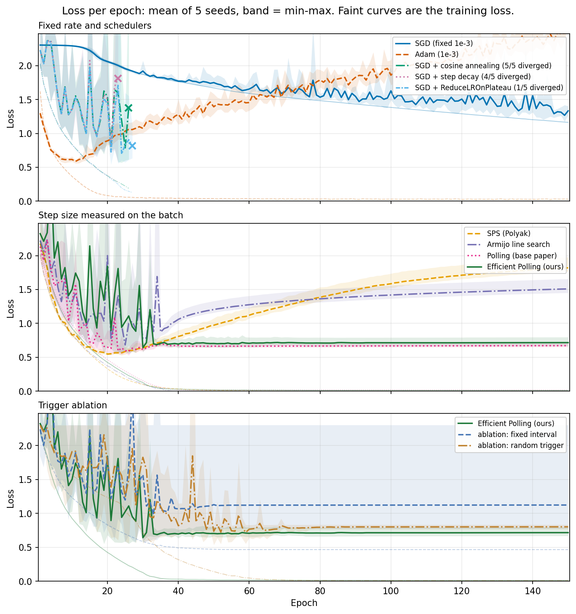
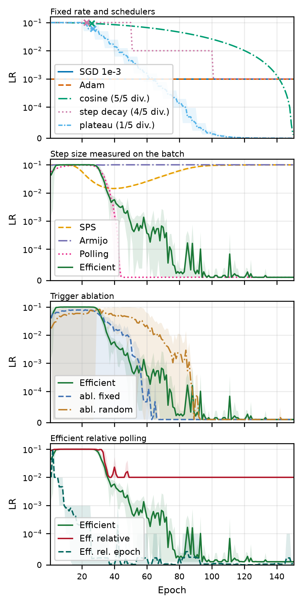

# Otimização Eficiente da Taxa de Aprendizado Baseada em Polling para Redes Neurais

> A acurácia da seleção de taxa de aprendizado por polling, ao custo de um SGD comum.

[](https://pypi.org/project/efficient-polling-lr-scheduler/)
[](https://pypi.org/project/efficient-polling-lr-scheduler/)
[](LICENSE)

```bash
pip install efficient-polling-lr-scheduler
```

[🇺🇸 English version](README.md) · [📄 Artigo (fonte LaTeX)](docs/main.tex)

Este repositório replica o **Método de Polling** de Tan et al. no CIFAR-10 e introduz o **Efficient Polling**, uma extensão inédita que recupera o mesmo cronograma de taxa de aprendizado — e a mesma acurácia — fazendo poll em apenas **5,43% dos batches**, reduzindo os passos do otimizador em 79% e o tempo de parede por época de 8,05s para 2,81s, o custo de um SGD comum. O método é avaliado sobre **cinco seeds aleatórias** contra **oito métodos de comparação** — Adam, três schedulers, SPS, Armijo backtracking e o método base de Polling replicado — mais duas ablações que isolam a contribuição do gatilho adaptativo de poll. Todos os métodos são distribuídos como um pacote PyTorch.

---

## Resumo rápido

A taxa de aprendizado (LR) é o hiperparâmetro mais influente no treinamento por gradiente. Em vez de escolhê-la manualmente ou por um cronograma fixo, o **polling** testa vários candidatos de LR a cada batch e mantém aquele que mais melhora a acurácia no batch. Funciona muito bem, mas multiplica o tempo de treinamento pelo número de candidatos.

O **Efficient Polling** observa que a escolha do poll é altamente redundante — dentro de cada fase do treinamento, polls consecutivos selecionam a mesma LR — e faz poll *sob demanda*: um cronograma de *backoff exponencial* dobra o intervalo entre polls enquanto a seleção é estável, e uma guarda anti-divergência em dois níveis protege os passos não pollados.

| Método | Melhor Val | Acc Teste | Perda Teste | Batches com poll | s/Época |
|---|---|---|---|---|---|
| Baseline (SGD fixo, `1e-3`) | 56,50% | 56,06% | 1,2274 | — | 2,86 |
| Polling (paper base) | 84,08% | 83,83% | 0,6821 | 100% | 8,05 |
| **Efficient Polling (nosso)** | **84,37%** | 83,76% | 0,7392 | **5,43%** | **2,81** |

*150 épocas, média ± desvio padrão amostral sobre cinco seeds (42–46), NVIDIA RTX 5070. A comparação completa, treze configurações com a extensão Relative Polling — Adam, três schedulers, SPS, Armijo backtracking e duas variantes de ablação do gatilho — está em [Resultados](#resultados).*

O Efficient Polling **iguala** a acurácia do método base (dentro de 0,1 pp no teste) reduzindo os passos do otimizador em **79%** e o tempo por época de 8,05s para **2,81s** — 2,9× mais rápido que o Polling base, indistinguível dos 2,86s do SGD puro.

---

## Começando

```bash
pip install efficient-polling-lr-scheduler
```

O polling precisa reavaliar o modelo para pontuar um passo candidato, então, em vez do `optimizer.step()` puro, você passa uma **closure** que retorna `(loss, score)` — o mesmo contrato do `torch.optim.LBFGS`, mais o score a ser maximizado. O `make_closure` a constrói para você:

```python
import torch
from efficient_polling_lr_scheduler import EfficientPollingSGD, make_closure

model = MyModel().to(device)
loss_fn = torch.nn.CrossEntropyLoss()

# As LRs candidatas são, por padrão, {1e-5, 1e-4, 1e-3, 1e-2, 1e-1} em torno de lr.
optimizer = EfficientPollingSGD(model, lr=1e-3)

for inputs, targets in train_loader:
    inputs, targets = inputs.to(device), targets.to(device)
    info = optimizer.step(make_closure(model, loss_fn, inputs, targets))
    # info.lr, info.loss, info.polled, info.spike, info.rolled_back, ...
```

Sem cronograma de taxa de aprendizado, sem warmup, sem tuning: a LR é *medida*. Troque `EfficientPollingSGD` por `PollingSGD` para o método base (poll a cada batch), ou envolva qualquer otimizador:

```python
from efficient_polling_lr_scheduler import EfficientPollingOptimizer

optimizer = EfficientPollingOptimizer(
    torch.optim.SGD(model.parameters(), lr=1e-3, momentum=0.9),
    candidate_lrs=(1e-5, 1e-4, 1e-3, 1e-2, 1e-1),
    module=model,          # para restaurar os buffers de BatchNorm entre os testes
    max_poll_interval=64,  # teto do backoff; 0 faz poll a cada batch
)
```

O pacote também traz os dois baselines de comparação usados no artigo — o Polyak step-size estocástico (SPS) e a busca de linha Armijo backtracking, ambos derivando o tamanho do passo a partir do batch atual sem forward pass extra:

```python
from efficient_polling_lr_scheduler import SPSSGD, ArmijoSGD

optimizer = SPSSGD(model, lr=1e-3, max_lr=0.1)
# ou
optimizer = ArmijoSGD(model, lr=1e-3, lr_max=0.1)
```

Os helpers opcionais de treino rodam uma comparação completa em poucas linhas e também aceitam um otimizador comum (e opcionalmente um `torch.optim.lr_scheduler`) — assim o baseline, o Adam e os schedulers padrão passam pelo mesmo loop:

```python
from efficient_polling_lr_scheduler import fit

history = fit(model, train_loader, val_loader, optimizer, loss_fn, epochs=150)
print(history.best_val_acc, sum(history.polls), sum(history.optimizer_steps))
```

### API

| Objeto | Papel |
|---|---|
| `EfficientPollingSGD` / `EfficientPollingOptimizer` | método proposto: poll sob demanda, com a guarda anti-divergência |
| `PollingSGD` / `PollingOptimizer` | método base: poll a cada batch |
| `RelativePollingSGD` / `RelativePollingOptimizer` | Relative Polling (experimental): três candidatos em torno da taxa em uso, backoff sem teto no estilo TCP, restarts a partir do melhor ponto |
| `RelativeEpochPolling` | o mesmo método por época, conduzido por `fit(..., epoch_polling=...)` sobre um otimizador comum |
| `SPSSGD` / `SPSOptimizer` | baseline de comparação: Polyak step-size estocástico |
| `ArmijoSGD` / `ArmijoOptimizer` | baseline de comparação: busca de linha Armijo backtracking estocástica |
| `TRIGGERS` | os três gatilhos de poll usados na ablação: `"backoff"` (padrão), `"fixed"`, `"random"` |
| `make_closure`, `accuracy`, `negative_loss` | closure do batch e critérios de seleção (acurácia ou perda) |
| `StepInfo`, `EpochStats`, `History` | telemetria: LR escolhida, polls, spikes, rollbacks, passos do otimizador |
| `fit`, `train_epoch`, `evaluate` | helpers opcionais do loop de treino, aceitando um `torch.optim.lr_scheduler` para os métodos de comparação com otimizador comum |
| `StateSnapshot` | salvamento/restauração exata de parâmetros, buffers e estado do otimizador |

**Observações.** Apesar do nome do pacote, estas classes **não** são subclasses de `torch.optim.lr_scheduler.LRScheduler`: elas envolvem o otimizador e são acionadas inteiramente por `optimizer.step(closure)`, então não existe um `scheduler.step()` separado para chamar depois. As LRs candidatas são absolutas e aplicadas a *todos* os parameter groups, sobrescrevendo LRs por grupo. Passe `module=` (ou o próprio modelo como primeiro argumento) sempre que o forward mutar buffers, para que os testes não contaminem as estatísticas de BatchNorm. A closure não deve chamar `backward()` nem `zero_grad()` — quem cuida disso é o otimizador.

---

## Como funciona

### Polling (método base replicado)

A cada batch, após calcular o gradiente `g` a partir dos pesos `θ`, cada candidato de LR é aplicado como passo de teste e o vencedor é mantido:

```
θ̂ₖ = θ − lrₖ · g               para cada lrₖ ∈ C
k*  = argmax acc(θ̂ₖ, batch)     (empates → menor lr)
θ   ← θ̂ₖ*
```

O conjunto de candidatos é `C = {1e-5, 1e-4, 1e-3, 1e-2, 1e-1}`, abrangendo quatro ordens de magnitude em torno da LR base. Os passos de teste são feitos copiando o estado do modelo + otimizador uma vez e recarregando-o antes de cada candidato, de modo que todos partam de condições pré-passo idênticas. Como os testes sobrescrevem os pesos, o passo vencedor é reaplicado uma vez a partir do snapshot, então um poll custa `N + 1 = 6` passos de otimizador em vez de `N = 5`.

### Efficient Polling (extensão proposta)

O mecanismo de seleção é mantido intacto, mas só se faz poll num batch quando necessário:

1. **Cronograma adaptativo de poll.** Seja `K` o intervalo de poll. Após um poll, se a seleção não muda, `K ← min(2K, K_max)` (backoff geométrico, limitado a `K_max = 64`); se mudou, `K ← 1` (poll a cada batch até estabilizar de novo). Entre polls, um único passo SGD cego usa a última LR selecionada. O backoff só entra em ação depois que um poll efetivamente mostrou *sinal* — isto é, as acurácias dos candidatos diferem entre si. Na inicialização, todo candidato empata, e tratar um empate como seleção estável travaria o treino na menor LR candidata para sempre; a [ablação do gatilho](#ablação-do-gatilho) reproduz exatamente essa falha numa variante que não tem essa regra.

2. **Guarda anti-divergência em dois níveis.** Passos cegos não têm validação por passo, então um passo com LR alta pode divergir. A guarda reaproveita quantidades já computadas:
   - **Nível 2 — polls disparados por spike (prevenção):** se a perda do batch ultrapassa `γ · EMA(perda)` (`γ = 3`, `β = 0,9`), faz poll imediatamente para que o critério de acurácia possa rejeitar um passo explosivo.
   - **Nível 1 — checkpoints de rollback (recuperação):** o snapshot de cada poll também serve como checkpoint conhecidamente bom; se a perda for não-finita ou ultrapassar `2·ln(C) ≈ 4,61`, restaura o checkpoint e retoma o polling.

Nas cinco execuções oficiais, os polls disparados por spike somaram em média 378 por execução (6,6% de todos os polls), e o nível de recuperação disparou apenas duas vezes em todo o estudo, ambas na mesma seed. Sua necessidade é real, porém: uma execução inicial sem guarda divergiu para `NaN` na época 33, a partir de um único passo cego com `lr = 1e-1`, e nunca se recuperou — a mesma falha que matou a maioria dos schedulers manuais na comparação (ver [Resultados](#resultados)).

3. **Gatilhos alternativos (ablação).** `trigger="fixed"` faz poll a cada `K + 1` batches, com intervalo constante em vez de backoff, e `trigger="random"` faz poll em cada batch independentemente com probabilidade `p`. Ambos mantêm a regra 2 (a guarda) e o mecanismo de seleção intactos, e ambos são calibrados para a taxa de ~5% que o backoff adaptativo mede, de modo que a comparação isola o gatilho, não o orçamento de polls. Ver [Ablação do gatilho](#ablação-do-gatilho).

| Símbolo | Valor | Papel |
|---|---|---|
| `C` | `{1e-5, …, 1e-1}` | taxas de aprendizado candidatas |
| `lr_init` | `1e-3` | LR antes do primeiro poll |
| `K_max` | `64` | intervalo máximo de poll (teto do backoff) |
| `γ` | `3` | limiar de spike (nível 2) |
| `β` | `0,9` | decaimento da EMA da perda |
| `ℓ_rb` | `2·ln 10 ≈ 4,61` | limiar de rollback (nível 1) |

### Relative Polling (extensão proposta, por batch)

Os dois métodos acima escolhem dentro de uma grade *fixa*, e nas runs registradas a taxa escolhida passa a maior parte do treino encostada nas bordas dessa grade: `1e-1` na primeira fase, `1e-5` depois do annealing. O Relative Polling dispensa a grade. O usuário escolhe uma taxa de aprendizado e um multiplicador `m`, e cada poll testa três candidatos em torno da taxa em uso; o vencedor vira o novo centro:

```
C_t = {X/m, X, X·m}        X ← argmax acc(θ̂, batch)
```

Quando um poll volta cego — todos os candidatos com a mesma pontuação, o que a acurácia do batch faz sempre que um passo não muda nenhuma predição — o poll seguinte olha um multiplicador mais longe nos dois sentidos, e continua alargando até enxergar uma diferença; um poll com sinal estreita a janela de volta. Três regras completam o método:

1. **Backoff sem teto, limitado pela falha.** O intervalo de poll `k` dobra quando um poll agendado com sinal mantém a taxa, um poll cego o deixa como está, e não tem `K_max`. Cada poll registra o *melhor* ponto visto até então — pesos, estado do otimizador e taxa, julgados por uma tendência lenta da perda. Quando um trecho cego estoura, o treino volta no tempo até esse ponto, `k` vai a zero e o teto do próximo slow start passa a ser metade do intervalo que estourou; o crescimento é exponencial até o teto e linear acima dele, como no controle de congestionamento do TCP.
2. **Empate mantém a taxa, exceto depois de um restart.** Um empate não carrega informação, então um poll comum mantém `X`. O poll logo depois de um restart desempata um degrau *para baixo*, porque um restart tem uma única causa — taxa alta demais para passos cegos.
3. **Tendência no estilo Adam.** A tendência da perda é uma média exponencial com correção de viés mais um segundo momento dos desvios, de modo que um spike é uma perda mais de `z` desvios acima da tendência, em vez de uma razão fixa sobre ela.

```python
from efficient_polling_lr_scheduler import RelativePollingSGD

optimizer = RelativePollingSGD(model, lr=1e-3, multiplier=10.0, lr_max=1e-1)
```

| Símbolo | Padrão | Papel |
|---|---|---|
| `lr` | `1e-3` | a única taxa que o usuário escolhe |
| `m` | `10` | espaçamento dos candidatos |
| `lr_min`, `lr_max` | nenhum | limites opcionais; os experimentos usam o teto `1e-1` por paridade com a tabela abaixo |
| `z` | `3` | limiar de spike, em desvios acima da tendência |
| `ℓ_rb` | `2·ln 10` | limiar de estouro, como acima |

**Resultados.** Mesmo protocolo da tabela abaixo, cinco seeds, candidatos limitados a `1e-1`:

| Método | Melhor Val | Acurácia Teste | Perda Teste | Polls | Passos do otimizador | s/Época |
|---|---|---|---|---|---|---|
| Efficient Polling (grade fixa) | 84,37% ± 0,91% | 83,76% ± 0,72% | 0,7392 ± 0,0201 | 5,43% | 134.261 | 2,81 ± 0,02 |
| **Relative Polling, por batch** | 84,68% ± 0,77% | **84,11% ± 0,41%** | 0,9803 ± 0,1398 | 7,25% ± 6,25% | 127.379 | 2,82 ± 0,25 |
| Relative Polling, por época | 48,18% ± 2,61% | 47,99% ± 1,91% | 1,4184 ± 0,0450 | 61,33% | 234.432 | 6,47 ± 0,52 |

Por batch, o Relative Polling alcança a acurácia de teste do Armijo backtracking (84,09%, a melhor da tabela abaixo) ao custo do SGD puro, com poll em 7% dos batches; um poll custa 4 passos do otimizador em vez de 6, então ele dá menos passos que o Efficient Polling. Ele encontra a mesma primeira fase em `1e-1` e depois se assenta em `1e-2` da época ~40 até o fim, em vez de anelar até `1e-5`: quando a acurácia do batch satura o critério fica cego, empates mantêm a taxa, e nenhum estouro forçou um degrau para baixo (um restart em cinco runs). Esse patamar é o que custa perda de teste — o treino continua em `1e-2` sobre um conjunto de treino que ele já ajusta, e as predições ficam superconfiantes. A fração de polls varia por seed (1,8% a 16,3%): uma seed que fica caçando entre `1e-1` e `1e-2` zera o intervalo a cada mudança.

**A taxa que o usuário escolhe não precisa estar certa.** Partindo de duas décadas abaixo ou acima do padrão, na seed 42:

| Início | Efficient Polling (grade presa ao início) | Relative Polling |
|---|---|---|
| `1e-5` | 10,04% — nunca sai de `1e-7` | 84,72% |
| `1e-3` (padrão) | 83,97% | 84,67% |
| `1e-1` | 9,98% — explode em `10` | 84,62% |

De qualquer início a janela relativa está em `1e-1` na primeira época e reproduz o mesmo cronograma.


**Por época é um resultado negativo.** `RelativeEpochPolling`, conduzido por `fit(..., epoch_polling=...)`, treina uma época inteira por candidato a partir de um snapshot e mantém a que teve a menor loss média de treino. Ele leva a taxa até `1e-5` em trinta épocas e estaciona em 48%; selecionar pela acurácia de validação no fim da época fez o mesmo, até `1e-8` e 45%. Qualquer nota de uma única época premia a suavidade de um passo pequeno em vez do progresso de um passo grande, e uma época cega em `1e-1` não tem a proteção por passo que o método por batch ganha com os polls de spike. A granularidade que funciona é o batch.

---

## Resultados

A tabela abaixo reproduz a Tabela I do artigo, onze configurações, mais as duas configurações do Relative Polling adicionadas depois do artigo; cada uma executada em cinco seeds (42–46), 150 épocas, batch 64 (704 batches/época, 105.600/execução). Reportada como média ± desvio padrão amostral.

| Método | Melhor Val | Acc Teste | Perda Teste | Poll | Passos do Otimizador | s/Época |
|---|---|---|---|---|---|---|
| SGD (fixo `1e-3`) | 56,50% ± 1,81% | 56,06% ± 1,76% | 1,2274 ± 0,0455 | n/a | 105.600 | 2,86 ± 0,01 |
| Adam (`1e-3`) | 82,75% ± 0,42% | 81,83% ± 0,55% | 1,1310 ± 0,3572 | n/a | 105.600 | 3,03 ± 0,01 |
| SGD + cosine annealing | 82,44% ± 1,13% | 81,73% ± 1,10% | **0,6727 ± 0,0645** | n/a | 105.600 | 2,85 ± 0,08 |
| SGD + step decay | 80,61% ± 3,65% | 80,35% ± 3,37% | 0,7732 ± 0,2402 | n/a | 105.600 | 2,76 ± 0,00 |
| SGD + ReduceLROnPlateau | 83,51% ± 1,44% | 83,02% ± 1,12% | 0,8942 ± 0,1624 | n/a | 105.600 | 2,77 ± 0,00 |
| SPS (Polyak) | 83,71% ± 0,45% | 82,86% ± 0,35% | 1,0695 ± 0,2744 | n/a | 105.600 | 2,96 ± 0,00 |
| Armijo line search | **84,68% ± 0,56%** | **84,09% ± 0,38%** | 1,2587 ± 0,1395 | 100% | 106.090 | 4,11 ± 0,12 |
| Polling (paper base) | 84,08% ± 0,81% | 83,83% ± 0,14% | 0,6821 ± 0,0091 | 100% | 633.600 | 8,05 ± 0,05 |
| **Efficient Polling (nosso)** | 84,37% ± 0,91% | 83,76% ± 0,72% | 0,7392 ± 0,0201 | **5,43%** | **134.261** | **2,81 ± 0,02** |
| ↳ ablação: intervalo fixo | 69,20% ± 33,49% | 68,91% ± 32,91% | 1,0999 ± 0,6782 | 5,43% | 134.286 | 2,81 ± 0,01 |
| ↳ ablação: gatilho aleatório | 84,45% ± 0,61% | 84,02% ± 0,54% | 0,8116 ± 0,0235 | 5,77% | 136.085 | 2,83 ± 0,01 |
| **Relative Polling (nosso, por batch)** | 84,68% ± 0,77% | **84,11% ± 0,41%** | 0,9803 ± 0,1398 | 7,25% | 127.379 | 2,82 ± 0,25 |
| ↳ por época | 48,18% ± 2,61% | 47,99% ± 1,91% | 1,4184 ± 0,0450 | 61,33% | 234.432 | 6,47 ± 0,52 |

Os três schedulers começam em `1e-1` (o topo do conjunto de candidatos) em vez da LR base `1e-3` do baseline, já que um cronograma de decaimento precisa de algo de onde decair; SPS e Armijo são limitados a esse mesmo `1e-1`, de modo que nenhum método pode dar um passo que os outros nunca puderam considerar. Apesar disso, cosine annealing, step decay e ReduceLROnPlateau divergem para `NaN` por volta da época 28 na maioria das seeds (5/5, 4/5 e 1/5, respectivamente) — a tabela ainda os credita com o melhor checkpoint pré-divergência, já que cada método é avaliado na sua própria melhor época de validação. As duas variantes de polling mantêm essa mesma `1e-1` por cerca de trinta épocas ao longo de suas 25 execuções combinadas, sem uma única falha: o que quebra os schedulers não é a taxa em si, mas a ausência de uma verificação por passo sobre ela.

Ambos os métodos de polling descobrem autonomamente o mesmo **cronograma de duas fases** inteiramente a partir do feedback no nível do batch: a LR média selecionada converge para `≈1e-1` já na primeira época, permanece ali por ~30 épocas, e então colapsa para `≈1e-5` para refinamento fino perto da convergência — o Polling base completa o annealing entre as épocas 42–45, o Efficient Polling de forma mais gradual, entre as épocas 49–78 (o intervalo ainda não resetou para um a cada batch).

| | |
|---|---|
|  |  |
| Perda de treino e validação, treze configurações. | LR média selecionada por época, symlog, com um X marcando divergência. |


Os polls se concentram exatamente onde o cronograma muda: o piso de regime permanente é `704 / (K_max + 1) ≈ 11` polls/época, a mediana sobre todas as épocas é 16,4, e a contagem tem seu pico em 231 na época 32 — o momento exato em que a LR selecionada começa a colapsar de `1e-1` para `1e-5`, quando polls discordantes resetam o intervalo para um repetidamente. É esse o mecanismo que permite a ~5% dos polls recuperarem o cronograma completo de duas fases.

### Modelo de custo

Um poll custa `N + 1 = 6` passos de otimizador (um teste por candidato, mais a reaplicação do vencedor). Com `P` polls entre `B = 105.600` batches:

```
S_eff = P·(N+1) + (B − P) = B + N·P
```

Com os `P = 5.732,2` polls medidos em média nas cinco execuções, isso dá `134.261` passos — uma redução de 79% em relação aos `633.600` do Polling base, reproduzindo exatamente a tabela acima. Apenas 26% desses passos vêm de polls; os 74% restantes são passos SGD comuns, o que explica o tempo por época ficar no nível do SGD puro.

### Ablação do gatilho

Duas variantes de controle isolam a contribuição do backoff adaptativo trocando apenas o gatilho, mantendo o conjunto de candidatos, a regra de seleção e a guarda de dois níveis inalterados: `fixed` faz poll em intervalo constante (`K = 19`) e `random` faz poll em cada batch independentemente com probabilidade `p = 0,05`, ambos calibrados para a taxa de ~5% que o backoff mede.

Na acurácia final, o **gatilho aleatório é competitivo** — 84,02% de teste contra 83,76% do backoff, dentro da variação entre seeds. É um resultado negativo honesto para a leitura forte da alegação: nesse orçamento, distribuir os polls uniformemente ao acaso já basta para acompanhar o cronograma, desde que a guarda absorva o custo de chegar atrasado na transição. A alegação sustentada é a mais fraca — o backoff alcança a mesma qualidade gastando seus polls onde eles carregam informação (16,4 polls numa época mediana contra um pico de 231 na transição, uma razão de 14×, contra um patamar plano de ~40/época para os dois controles), precisando de **~2,4× menos** intervenções de guarda disparadas por spike (378 contra 919 e 888) e ligeiramente menos passos de otimizador.

O **controle de intervalo fixo expõe uma falha real**: em 4/5 seeds ele iguala as outras variantes (84,17% ± 0,96% de validação), mas na seed restante nunca sai do patamar de inicialização, terminando em ~10% de acurácia (nível de chute aleatório) — porque, na inicialização, todo candidato empata, o poll continua retornando a menor LR candidata pela regra de desempate, e em `1e-5` os pesos se movem pouco demais para algum dia quebrar o empate. O backoff adaptativo é imune por construção, já que se recusa a entrar em backoff até que um poll tenha efetivamente discriminado entre os candidatos (regra 1 acima).

---

## Estrutura do repositório

```
.
├── src/efficient_polling_lr_scheduler/     # o pacote instalável
│   ├── polling.py             # método base (Tan et al.)
│   ├── efficient.py           # Efficient Polling (nosso), incl. os gatilhos fixo/aleatório
│   ├── relative.py            # Relative Polling (nosso): janela que alarga, backoff estilo TCP, restarts no melhor ponto
│   ├── baselines.py           # otimizadores de comparação SPS e Armijo backtracking
│   ├── _snapshot.py           # salvamento/restauração exata do estado nos testes
│   ├── closures.py            # closures do batch e critérios de seleção
│   └── training.py            # helpers opcionais fit/train_epoch/evaluate
├── tests/                     # suíte pytest dos algoritmos
├── examples/
│   ├── cifar10.py             # reproduz as treze configurações via CLI
│   └── plot_results.py        # redesenha as figuras a partir das execuções gravadas
├── notebooks/
│   └── cifar10.ipynb          # experimentos originais: dados, modelo, os 13 métodos, plots
├── docs/
│   └── main.tex                # o artigo (formato IEEE)
├── images/                    # figuras usadas no artigo e neste README
├── results/cifar10/           # as 69 execuções gravadas: 13 configurações × 5 seeds, mais 4 runs de taxa inicial
├── models/                    # melhores checkpoints por método (.pt, gitignored)
├── pyproject.toml
├── CHANGELOG.md
├── README.md
└── README(pt-br).md
```

## Configuração

Para *usar* os métodos, basta o pacote (Python 3.10+, PyTorch 2.0+):

```bash
pip install efficient-polling-lr-scheduler
```

Para *reproduzir os experimentos*, clone o repositório e instale com os extras. Uma GPU compatível com CUDA é recomendada (CPU funciona, mas é lento):

```bash
git clone https://github.com/luiz-linkezio/Efficient-Polling-Based-Learning-Rate-Optimization-for-Neural-Networks.git
cd Efficient-Polling-Based-Learning-Rate-Optimization-for-Neural-Networks
python -m venv venv
source venv/bin/activate
pip install -e ".[dev,examples]" jupyter
```

### Conjunto de dados

Os experimentos carregam a versão **CIFAR-10 Python** de um diretório local (os arquivos `data_batch_*` / `test_batch` em pickle). Baixe do [site oficial](https://www.cs.toronto.edu/~kriz/cifar.html):

```bash
curl -O https://www.cs.toronto.edu/~kriz/cifar-10-python.tar.gz
tar -xzf cifar-10-python.tar.gz
```

## Execução

O script de exemplo roda todas as configurações em uma ou mais seeds e imprime a tabela comparativa, retomando um sweep a partir de resultados já salvos:

```bash
python examples/cifar10.py --data-dir /caminho/para/cifar-10-batches-py --seeds 42 43 44 45 46
# um método, uma seed, execução mais curta:
python examples/cifar10.py --data-dir ... --methods efficient --seeds 42 --epochs 20
```

Os resultados são gravados em `--results-dir` (padrão `results/cifar10/`), um JSON por par `(método, seed)`. O `examples/plot_results.py` redesenha as figuras a partir desses arquivos, então um gráfico nunca pode discordar da tabela:

```bash
python examples/plot_results.py --results-dir results/cifar10 --out-dir images
```

Rode a suíte de testes com `pytest`.

Como alternativa, abra o notebook original e rode as células de cima para baixo, apontando `DATA_DIR` (na célula **Constants**) para o diretório `cifar-10-batches-py` extraído:

```bash
jupyter notebook notebooks/cifar10.ipynb
```

O notebook está organizado como: Imports → Constants → Configs (seeds `42`–`46`, device) → Data (dataset, estatísticas de normalização, split 90/10 treino/val) → Model (`SimpleCIFAR10CNN`, ~0,56M params) → Train (treze configurações, um único loop compartilhado) → Animações e plots → Test. Os melhores checkpoints são gravados em `models/`.

> **Reprodutibilidade.** Cinco seeds (42–46) fixam, cada uma, a inicialização dos pesos, o embaralhamento dos dados e o split treino/val, de modo que numa dada seed todos os métodos partem dos mesmos pesos e veem a mesma ordem de batches. Todos os números acima são a média ± desvio padrão amostral sobre as cinco execuções.

---

## Configuração experimental

- **Dataset:** CIFAR-10 — 45.000 treino / 5.000 val / 10.000 teste, normalizado por canal com estatísticas do treino.
- **Modelo:** `SimpleCIFAR10CNN`, uma CNN de 5 camadas (canais conv 64→64→128→128→256, kernels `3×3`, ReLU, MaxPool, AdaptiveAvgPool, cabeça Linear), **557.898 parâmetros**, sem batch norm nem dropout, para que o otimizador seja a única fonte de adaptação.
- **Otimizador:** SGD puro (sem momentum, sem weight decay) para o método proposto e o replicado, batch 64, LR base `1e-3`, 150 épocas (704 batches/época, 105.600 no total).
- **Métodos de comparação:** Adam, cosine annealing, step decay, ReduceLROnPlateau, SPS (Polyak step-size), Armijo backtracking line search e o método de Polling base replicado — oito no total, mais duas variantes de ablação do gatilho do método proposto.
- **Seeds:** cinco (42–46) por configuração, treze configurações, 65 execuções no total, mais quatro runs de robustez à taxa inicial na seed 42.
- **Hardware:** uma única NVIDIA GeForce RTX 5070 (12 GB).

---

## Citação

Se você usar este trabalho, cite o artigo:

```bibtex
@misc{souzasilva_efficient_polling_lr_scheduler,
  title  = {Efficient Polling-Based Learning Rate Optimization for Neural Networks},
  author = {de Souza Silva, Jos{\'e} R. and B. A. da Silva, Luiz Henrique and B. de Souza, Caio B. and Balieiro, Andson M.},
  year   = {2026},
  note   = {Centro de Inform{\'a}tica (CIn), Universidade Federal de Pernambuco (UFPE)},
  url    = {https://github.com/luiz-linkezio/Efficient-Polling-Based-Learning-Rate-Optimization-for-Neural-Networks}
}
```

O método de Polling base é de Tan et al. (ver `docs/base_paper.pdf`). O artigo completo, com trabalhos relacionados, a derivação do modelo de custo e a ablação do gatilho, está em `docs/main.tex`.

Para citar especificamente o software, acrescente `note = {Pacote Python \texttt{efficient-polling-lr-scheduler}}` ou referencie [o projeto no PyPI](https://pypi.org/project/efficient-polling-lr-scheduler/).

## 🧑‍💻 Autores

| [<br><sub>Luiz Henrique</sub><br>](https://github.com/luiz-linkezio) <sub>Desenvolvedor</sub><br> <sub>[Linkedin](https://www.linkedin.com/in/lhbas/)</sub><br> <sub> Portfolio </sub> | [<br><sub>José Ronaldo</sub><br>](https://github.com/Dev-JoseRonaldo) <sub>Desenvolvedor</sub><br> <sub>[Linkedin](https://www.linkedin.com/in/devjoseronaldo/)</sub><br> <sub>[Portfólio](https://joseronaldo.netlify.app/)</sub> |
| :-----------------------------------------------------------------------------------------------------------------------------------------------------------------------------------------------------------------------------------------------------------------------------------------------------------------------------------------------------: | :-----------------------------------------------------------------------------------------------------------------------------------------------------------------------------------------------------------------------------------------------------------------------------------------------------------------------------------------------------------: |

Universidade Federal de Pernambuco, Recife, Brasil. O artigo credita ainda Caio B. B. de Souza (UPE) e Andson M. Balieiro (CIn/UFPE) — ver [Citação](#citação).

## Licença

MIT — veja o arquivo [LICENSE](LICENSE) deste repositório.
