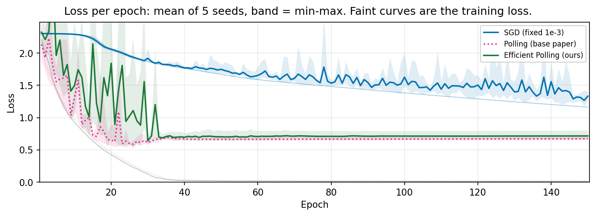
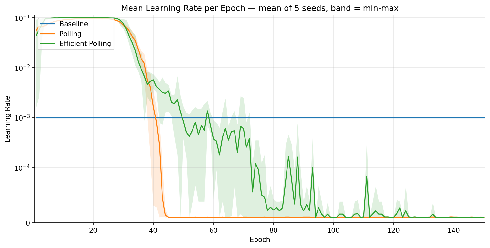
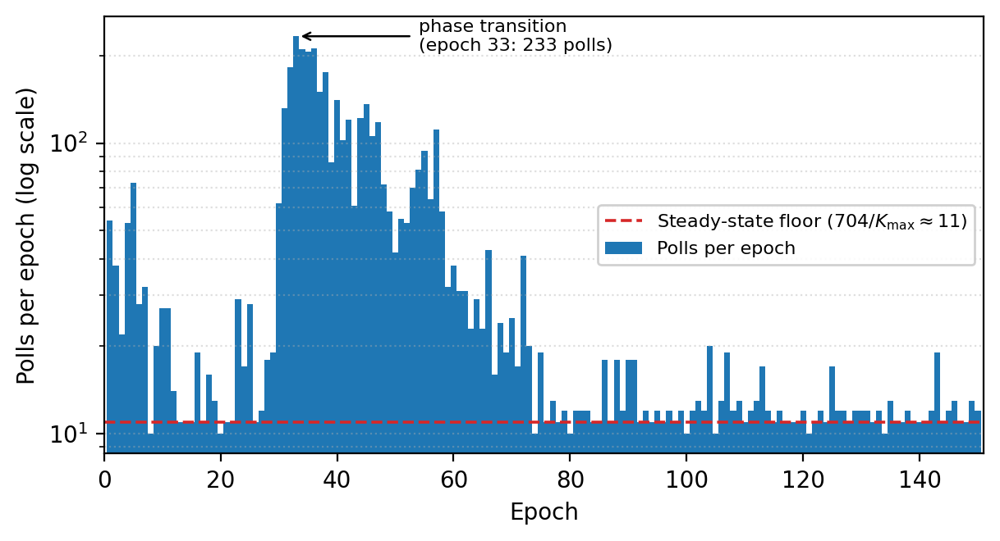

# Otimização Eficiente da Taxa de Aprendizado Baseada em Polling para Redes Neurais

> A acurácia da seleção de taxa de aprendizado por polling, ao custo de um SGD comum.

[](https://pypi.org/project/efficient-polling/)
[](https://pypi.org/project/efficient-polling/)
[](LICENSE)

```bash
pip install efficient-polling
```

[🇺🇸 English version](README.md) · [🎥 Vídeo da apresentação](videos/apresentação.mp4)

Este repositório replica o **Método de Polling** de Tan et al. no CIFAR-10 e introduz o **Efficient Polling**, uma extensão inédita que recupera o mesmo cronograma de taxa de aprendizado — e a mesma acurácia — fazendo poll em apenas **5% dos batches**, reduzindo os passos do otimizador em 75% e o tempo de parede por época em **3,3×**. Ambos os métodos são distribuídos como um pacote PyTorch.

---

## Resumo rápido

A taxa de aprendizado (LR) é o hiperparâmetro mais influente no treinamento por gradiente. Em vez de escolhê-la manualmente ou por um cronograma fixo, o **polling** testa vários candidatos de LR a cada batch e mantém aquele que mais melhora a acurácia no batch. Funciona muito bem, mas triplica o tempo de treinamento.

O **Efficient Polling** observa que a escolha do poll é altamente redundante — dentro de cada fase do treinamento, polls consecutivos selecionam a mesma LR — e faz poll *sob demanda*: um cronograma de *backoff exponencial* dobra o intervalo entre polls enquanto a seleção é estável, e uma guarda anti-divergência em dois níveis protege os passos não pollados.

| Método | Melhor Val | Acc Teste | Perda Teste | Batches com poll | s/Época |
|---|---|---|---|---|---|
| Baseline (SGD fixo, `1e-3`) | 57,28% | 56,70% | 1,2155 | — | 2,50 |
| Polling (paper base) | 84,65% | **83,99%** | **0,6832** | 100% | 9,10 |
| **Efficient Polling (nosso)** | **85,07%** | 83,93% | 0,7319 | **5,05%** | **2,79** |

*150 épocas, seed única (42), uma execução totalmente reprodutível por método, NVIDIA RTX 5070.*

O Efficient Polling **iguala** a acurácia do método base (dentro de 0,1 pp no teste) com apenas **12% acima do SGD puro** — contra os +264% do método base.

---

## Começando

```bash
pip install efficient-polling
```

O polling precisa reavaliar o modelo para pontuar um passo candidato, então, em vez do `optimizer.step()` puro, você passa uma **closure** que retorna `(loss, score)` — o mesmo contrato do `torch.optim.LBFGS`, mais o score a ser maximizado. O `make_closure` a constrói para você:

```python
import torch
from efficient_polling import EfficientPollingSGD, make_closure

model = MyModel().to(device)
loss_fn = torch.nn.CrossEntropyLoss()

# As LRs candidatas são, por padrão, {1e-5, 1e-4, 1e-3, 1e-2, 1e-1} em torno de lr.
optimizer = EfficientPollingSGD(model, lr=1e-3)

for inputs, targets in train_loader:
    inputs, targets = inputs.to(device), targets.to(device)
    info = optimizer.step(make_closure(model, loss_fn, inputs, targets))
    # info.lr, info.loss, info.polled, info.spike, info.rolled_back, ...
```

Sem cronograma de taxa de aprendizado, sem warmup, sem tuning: a LR é *medida*. Troque `EfficientPollingSGD` por `PollingSGD` para o método base (poll a cada batch), ou envolva qualquer otimizador:

```python
from efficient_polling import EfficientPollingOptimizer

optimizer = EfficientPollingOptimizer(
    torch.optim.SGD(model.parameters(), lr=1e-3, momentum=0.9),
    candidate_lrs=(1e-5, 1e-4, 1e-3, 1e-2, 1e-1),
    module=model,          # para restaurar os buffers de BatchNorm entre os testes
    max_poll_interval=64,  # teto do backoff; 0 faz poll a cada batch
)
```

Os helpers opcionais de treino rodam uma comparação completa em poucas linhas e também aceitam um otimizador comum — assim o baseline passa pelo mesmo loop:

```python
from efficient_polling import fit

history = fit(model, train_loader, val_loader, optimizer, loss_fn, epochs=150)
print(history.best_val_acc, sum(history.polls), sum(history.optimizer_steps))
```

### API

| Objeto | Papel |
|---|---|
| `EfficientPollingSGD` / `EfficientPollingOptimizer` | método proposto: poll sob demanda, com a guarda anti-divergência |
| `PollingSGD` / `PollingOptimizer` | método base: poll a cada batch |
| `make_closure`, `accuracy`, `negative_loss` | closure do batch e critérios de seleção (acurácia ou perda) |
| `StepInfo`, `EpochStats`, `History` | telemetria: LR escolhida, polls, spikes, rollbacks, passos do otimizador |
| `fit`, `train_epoch`, `evaluate` | helpers opcionais do loop de treino |
| `StateSnapshot` | salvamento/restauração exata de parâmetros, buffers e estado do otimizador |

**Observações.** As LRs candidatas são absolutas e aplicadas a *todos* os parameter groups, sobrescrevendo LRs por grupo. Passe `module=` (ou o próprio modelo como primeiro argumento) sempre que o forward mutar buffers, para que os testes não contaminem as estatísticas de BatchNorm. A closure não deve chamar `backward()` nem `zero_grad()` — quem cuida disso é o otimizador.

---

## Como funciona

### Polling (método base replicado)

A cada batch, após calcular o gradiente `g` a partir dos pesos `θ`, cada candidato de LR é aplicado como passo de teste e o vencedor é mantido:

```
ĝθₖ = θ − lrₖ · g           para cada lrₖ ∈ C
k*  = argmax acc(ĝθₖ, batch)   (empates → menor lr)
θ   ← ĝθₖ*
```

O conjunto de candidatos é `C = {1e-5, 1e-4, 1e-3, 1e-2, 1e-1}`, abrangendo cinco ordens de magnitude em torno da LR base. Os passos de teste são feitos copiando o estado do modelo + otimizador uma vez e recarregando-o antes de cada candidato, de modo que todos partam de condições pré-passo idênticas. Isso custa `N = 5` atualizações de teste **por batch**.

### Efficient Polling (extensão proposta)

O mecanismo de seleção é mantido intacto, mas só se faz poll num batch quando necessário:

1. **Cronograma adaptativo de poll.** Seja `K` o intervalo de poll. Após um poll, se a seleção não muda, `K ← min(2K, K_max)` (backoff geométrico, limitado a `K_max = 64`); se mudou, `K ← 1` (poll a cada batch até estabilizar de novo). Entre polls, um único passo SGD cego usa a última LR selecionada.

2. **Guarda anti-divergência em dois níveis.** Passos cegos não têm validação por passo, então um passo com LR alta pode divergir. A guarda reaproveita quantidades já computadas:
   - **Nível 2 — polls disparados por spike (prevenção):** se a perda do batch ultrapassa `γ · EMA(perda)` (`γ = 3`, `β = 0,9`), faz poll imediatamente para que o critério de acurácia possa rejeitar um passo explosivo.
   - **Nível 1 — checkpoints de rollback (recuperação):** o snapshot de cada poll também serve como checkpoint conhecidamente bom; se a perda for não-finita ou ultrapassar `2·ln(C) ≈ 4,61`, restaura o checkpoint e retoma o polling.

Na execução oficial, o nível de spike sozinho foi suficiente — **0 rollbacks** foram acionados. A necessidade dela é real, porém: uma execução inicial sem guarda divergiu para `NaN` na época 33, a partir de um único passo cego com `lr = 1e-1`, e nunca se recuperou.

| Símbolo | Valor | Papel |
|---|---|---|
| `C` | `{1e-5, …, 1e-1}` | taxas de aprendizado candidatas |
| `lr_init` | `1e-3` | LR antes do primeiro poll |
| `K_max` | `64` | intervalo máximo de poll (teto do backoff) |
| `γ` | `3` | limiar de spike (nível 2) |
| `β` | `0,9` | decaimento da EMA da perda |
| `ℓ_rb` | `2·ln 10 ≈ 4,61` | limiar de rollback (nível 1) |

---

## Resultados

Ambos os métodos de polling descobrem autonomamente um **cronograma de duas fases** inteiramente a partir do feedback no nível do batch: o maior candidato (`≈ 1e-1`) impulsiona a redução rápida da perda nas primeiras ~36 épocas, depois a seleção colapsa para o menor candidato (`≈ 1e-5`) para refinamento fino perto da convergência. O Efficient Polling recupera o mesmo cronograma fazendo poll em uma fração mínima dos batches.

| | |
|---|---|
|  |  |
| Perda de treino e validação ao longo de 150 épocas. | LR média selecionada por época (symlog). |



Os polls se concentram exatamente onde o cronograma muda: fora da transição de fase, a contagem fica no piso de regime permanente de `704 / K_max ≈ 11` polls/época; ela dispara para 233 na época 33 — o momento exato em que a LR selecionada colapsa de `1e-1` para `1e-5` — quando polls discordantes resetam o intervalo para um repetidamente. É esse o mecanismo que permite a 5% dos polls recuperarem o cronograma completo.

### Modelo de custo

Com `P = 5.337` polls ao longo de `B = 105.600` batches, cada poll custando `N + 1 = 6` passos e cada batch sem poll custando 1:

```
S_eff = P·(N+1) + (B − P) = 5.337·6 + 100.263 = 132.285 passos de otimizador
```

contra `528.000` do Polling base — uma redução de 75%, reproduzindo exatamente a contagem de passos medida.

---

## Apresentação

🎥 [Assista ao vídeo da apresentação](videos/apresentação.mp4) · 📊 [Slides (PDF)](docs/apresentacao_polling.pdf) · [Slides (PPTX)](docs/apresentacao_polling.pptx)

---

## Estrutura do repositório

```
.
├── src/efficient_polling/     # o pacote instalável
│   ├── polling.py             # método base (Tan et al.)
│   ├── efficient.py           # Efficient Polling (nosso)
│   ├── _snapshot.py           # salvamento/restauração exata do estado nos testes
│   ├── closures.py            # closures do batch e critérios de seleção
│   └── training.py            # helpers opcionais fit/train_epoch/evaluate
├── tests/                     # suíte pytest dos algoritmos
├── examples/
│   └── cifar10.py             # reproduz as três execuções do artigo via CLI
├── notebooks/
│   └── cifar10.ipynb          # experimentos originais: dados, modelo, os 3 métodos, plots
├── docs/
│   ├── apresentacao_polling.pdf
│   └── apresentacao_polling.pptx
├── videos/
│   └── apresentação.mp4       # vídeo da apresentação
├── images/                    # figuras usadas no artigo e neste README
├── models/                    # melhores checkpoints por método (.pt, gitignored)
├── pyproject.toml
├── CHANGELOG.md
├── README.md
└── README(pt-br).md
```

## Configuração

Para *usar* os métodos, basta o pacote (Python 3.10+, PyTorch 2.0+):

```bash
pip install efficient-polling
```

Para *reproduzir os experimentos*, clone o repositório e instale com os extras. Uma GPU compatível com CUDA é recomendada (CPU funciona, mas é lento):

```bash
git clone https://github.com/luiz-linkezio/Efficient-Polling-Based-Learning-Rate-Optimization-for-Neural-Networks.git
cd Efficient-Polling-Based-Learning-Rate-Optimization-for-Neural-Networks
python -m venv venv
source venv/bin/activate
pip install -e ".[dev,examples]" jupyter
```

### Conjunto de dados

Os experimentos carregam a versão **CIFAR-10 Python** de um diretório local (os arquivos `data_batch_*` / `test_batch` em pickle). Baixe do [site oficial](https://www.cs.toronto.edu/~kriz/cifar.html):

```bash
curl -O https://www.cs.toronto.edu/~kriz/cifar-10-python.tar.gz
tar -xzf cifar-10-python.tar.gz
```

## Execução

O script de exemplo roda os três métodos e imprime a tabela comparativa:

```bash
python examples/cifar10.py --data-dir /caminho/para/cifar-10-batches-py
# apenas um método, execução mais curta:
python examples/cifar10.py --data-dir ... --methods efficient --epochs 20
```

Rode a suíte de testes com `pytest`.

Como alternativa, abra o notebook original e rode as células de cima para baixo, apontando `DATA_DIR` (na célula **Constants**) para o diretório `cifar-10-batches-py` extraído:

```bash
jupyter notebook notebooks/cifar10.ipynb
```

O notebook está organizado como: Imports → Constants → Configs (seed `42`, device) → Data (dataset, estatísticas de normalização, split 90/10 treino/val) → Model (`SimpleCIFAR10CNN`, ~0,56M params) → Train (Baseline, Polling, Efficient Polling) → Animações e plots → Test. Os melhores checkpoints são gravados em `models/`.

> **Reprodutibilidade.** Uma única seed (42) fixa a inicialização dos pesos, o embaralhamento dos dados e o split treino/val, de modo que os três métodos diferem apenas na lógica da taxa de aprendizado. Todos os números acima vêm de uma execução por método.

---

## Configuração experimental

- **Dataset:** CIFAR-10 — 45.000 treino / 5.000 val / 10.000 teste, normalizado por canal com estatísticas do treino.
- **Modelo:** `SimpleCIFAR10CNN`, uma CNN de 5 camadas (canais conv 64→64→128→128→256, kernels `3×3`, ReLU, MaxPool, AdaptiveAvgPool, cabeça Linear), **557.898 parâmetros**, sem batch norm nem dropout, para que o otimizador seja a única fonte de adaptação.
- **Otimizador:** SGD puro (sem momentum, sem weight decay), batch 64, LR base `1e-3`, 150 épocas (704 batches/época, 105.600 no total).
- **Hardware:** uma única NVIDIA GeForce RTX 5070 (12 GB).

---

## Citação

Se você usar este trabalho, cite o artigo:

```bibtex
@misc{henrique_efficient_polling,
  title  = {Efficient Polling-Based Learning Rate Optimization for Neural Networks},
  author = {Henrique, Luiz and Ronaldo, Jos{\'e}},
  year   = {2026},
  note   = {Universidade Federal de Pernambuco},
  url    = {https://github.com/luiz-linkezio/Efficient-Polling-Based-Learning-Rate-Optimization-for-Neural-Networks}
}
```

O método de Polling base é de Tan et al. (ver `docs/base_paper.pdf`).

Para citar especificamente o software, acrescente `note = {Pacote Python \texttt{efficient-polling}}` ou referencie [o projeto no PyPI](https://pypi.org/project/efficient-polling/).

## 🧑‍💻 Autores

| [<br><sub>Luiz Henrique</sub><br>](https://github.com/luiz-linkezio) <sub>Desenvolvedor</sub><br> <sub>[Linkedin](https://www.linkedin.com/in/lhbas/)</sub><br> <sub> Portfolio </sub> | [<br><sub>José Ronaldo</sub><br>](https://github.com/Dev-JoseRonaldo) <sub>Desenvolvedor</sub><br> <sub>[Linkedin](https://www.linkedin.com/in/devjoseronaldo/)</sub><br> <sub>[Portfólio](https://joseronaldo.netlify.app/)</sub> |
| :-----------------------------------------------------------------------------------------------------------------------------------------------------------------------------------------------------------------------------------------------------------------------------------------------------------------------------------------------------: | :-----------------------------------------------------------------------------------------------------------------------------------------------------------------------------------------------------------------------------------------------------------------------------------------------------------------------------------------------------------: |

Universidade Federal de Pernambuco, Recife, Brasil.

## Licença

MIT — veja o arquivo [LICENSE](LICENSE) deste repositório.
