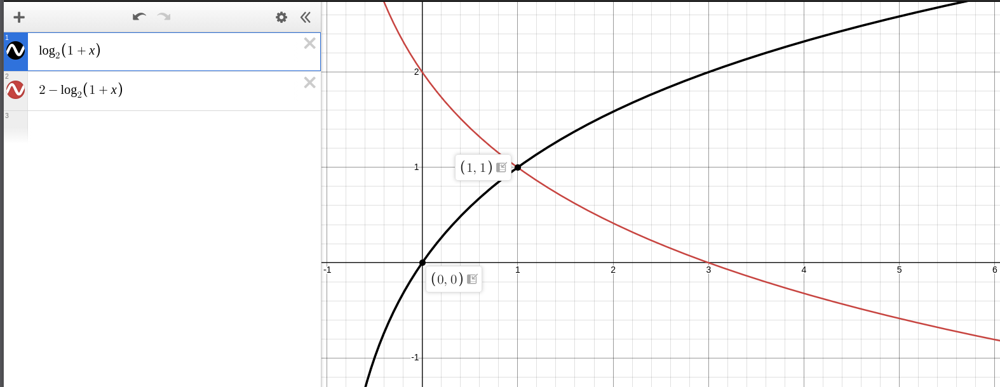
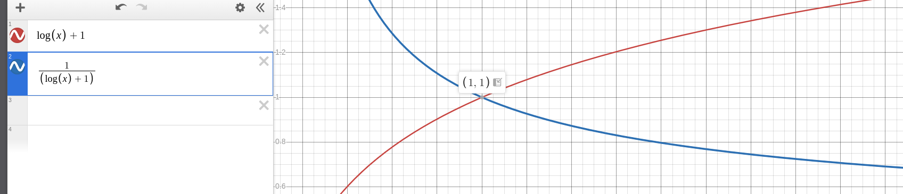
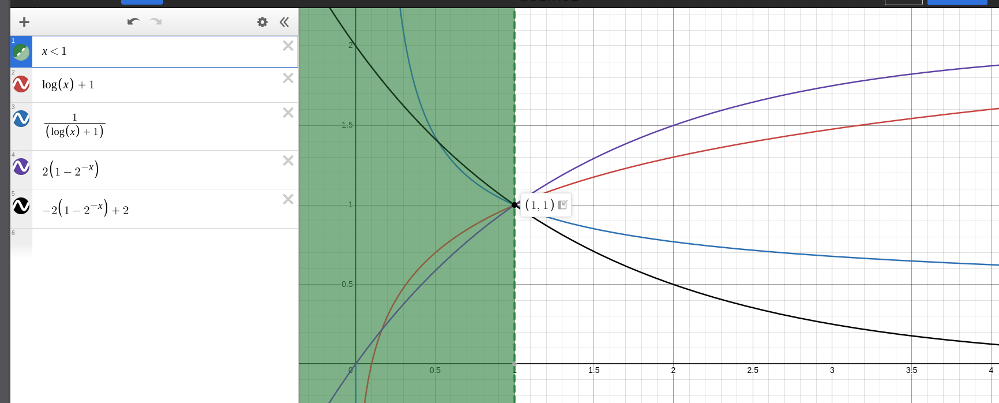

# Solução Proposta

Este trabalho propõe e avalia três estratégias adaptativas de taxa de aprendizado para treinamento de redes neurais convolucionais no conjunto de dados CIFAR-10, partindo do método de *polling* descrito em Tan, Choong & Lau (2026) e estendendo-o com abordagens híbridas.

## Arquitetura do Modelo

Todos os experimentos utilizam a mesma rede convolucional compacta (`SimpleCIFAR10CNN`), composta por seis camadas convolucionais organizadas em três blocos com canais crescentes (64 → 128 → 256), pooling adaptativo e uma camada totalmente conectada de saída:

```
SimpleCIFAR10CNN
├── Conv2d(3, 64, 3×3, pad=1) + ReLU
├── Conv2d(64, 64, 3×3, pad=1) + ReLU + MaxPool2d(2)
├── Conv2d(64, 128, 3×3, pad=1) + ReLU
├── Conv2d(128, 128, 3×3, pad=1) + ReLU + MaxPool2d(2)
├── Conv2d(128, 256, 3×3, pad=1) + ReLU
├── AdaptiveAvgPool2d(1×1) + Flatten
└── Linear(256, 10)
```

## Método de Polling (paper base)

Proposto originalmente em Tan *et al.* (2026), o método de *polling* substitui a atualização padrão de gradiente por uma busca por votação a cada *mini-batch*: dado um conjunto de $N$ taxas de aprendizado candidatas, o método testa independentemente cada candidato e mantém os pesos que produzem a maior acurácia no *batch* corrente.

**Candidatos (relativo ao LR base $\eta_0 = 10^{-5}$):**

$$\mathcal{C} = \{10^{-7},\ 10^{-6},\ 10^{-5},\ 10^{-4},\ 10^{-3}\}$$

**Algoritmo por batch:**

1. Calcular gradientes via *backpropagation*.
2. Para cada $\eta_i \in \mathcal{C}$: clonar estado do modelo e otimizador, aplicar passo de gradiente, medir acurácia no batch.
3. Manter o estado (pesos + otimizador) associado ao $\eta_i$ de maior acurácia.

Este mecanismo opera sem qualquer fórmula ou cronograma predefinido, deixando o próprio sinal de desempenho guiar a seleção do LR a cada passo.

## Novo Agendador de LR

Proposta original deste trabalho. Ajusta o LR com base na razão de melhoria de perda ao longo de uma janela de `patience` passos. As fórmulas foram projetadas para passar pelo ponto fixo $(1, 1)$ — nenhuma alteração quando não há melhoria — e escalar de forma suave, sem risco de explosão de gradiente.

**Parâmetros:** patience=30, $\beta=0{,}9$ (suavização EMA), sem limites de LR.

**Rastreamento de perda:**

$$\text{EMA}_t = \beta \cdot \text{EMA}_{t-1} + (1-\beta) \cdot \mathcal{L}_t$$

**Razão de melhoria (a cada `patience` passos):**

$$r = \frac{\mathcal{L}_{\text{início}}}{\text{EMA}_{\text{atual}}}$$

**Fórmulas de atualização do LR:**

Quando $r > 1$ (perda melhorou):

$$\text{fator}_\uparrow = 1 + \log(r), \qquad \text{fator}_\downarrow = \frac{1}{1 + \log(r)}$$

Quando $r \leq 1$ (perda não melhorou):

$$\text{fator}_\uparrow = 2\left(1 - 2^{-r}\right), \qquad \text{fator}_\downarrow = 1 - 2\left(1 - 2^{-r}\right)$$

A direção (aumentar/diminuir) alterna automaticamente quando o modelo para de melhorar, realizando busca bidirecional sem hiperparâmetros adicionais.

## Método de Polling Melhorado

Combina a exploração do método de *polling* com a adaptação baseada em fórmula do novo agendador. Em vez de candidatos fixos predeterminados, os três candidatos são gerados dinamicamente a partir do sinal de perda da janela corrente:

$$\eta_\text{up} = \eta \cdot (1 + \log(r)),\quad \eta_\text{atual} = \eta,\quad \eta_\text{down} = \frac{\eta}{1 + \log(r)}$$

**Algoritmo por batch:**

- Durante os `patience - 1` primeiros passos da janela: passo de gradiente normal com LR corrente.
- No passo `patience`: calcular $r$, gerar três candidatos, testar cada um e manter o que minimiza a perda no batch.

Isto permite que o espaço de busca cresça quando o modelo melhora rapidamente (exploração) e se contraia conforme a convergência avança (explotação).

---

# Experimentos

## Configuração Experimental

| Parâmetro | Valor |
|---|---|
| Dataset | CIFAR-10 (50 000 treino / 10 000 teste, 10 classes) |
| Divisão treino/val | 90% / 10% (estratificada) |
| Normalização | Média e desvio padrão por canal, calculados no treino |
| Batch size | 2048 |
| LR base | $10^{-5}$ |
| Weight decay | $5 \times 10^{-4}$ |
| Otimizador | Adam |
| Épocas | 150 |
| Hardware | GPU (CUDA) RTX 5070 |
| Semente | 42 (PyTorch + NumPy) |

**Normalização (média/desvio padrão por canal RGB):**

| Canal | Média | Desvio padrão |
|---|---|---|
| R | 125,31 | 62,99 |
| G | 122,95 | 62,09 |
| B | 113,87 | 66,70 |

## Replicação do Baseline

O *baseline* consiste em treinamento padrão com Adam e LR fixo de $10^{-5}$ durante 150 épocas, sem qualquer agendamento. Este experimento serve como linha de referência para avaliar o ganho de cada método adaptativo.

**Função de perda:** Cross-Entropy.

**Protocolo de avaliação:**
- Ao final de cada época, calcular perda e acurácia no conjunto de validação.
- Salvar o modelo com a maior acurácia de validação durante o treinamento.
- Avaliação final no conjunto de teste com o melhor modelo salvo.

**Resultados (150 épocas):**

| Ponto | Acurácia Val. | Acurácia Treino |
|---|---|---|
| Época 15 | 25,53% | 25,98% |
| Melhor val. (época 150) | **42,87%** | 42,81% |

- Acurácia de teste (melhor modelo): **42,92%** (perda: 1,5584)

A curva de aprendizado mostra crescimento consistente e monotônico durante todo o treinamento, típico de LR baixo e estável. O modelo não satura em 150 épocas, indicando que continuaria melhorando com mais treinamento.

## Experimento: Polling (paper base)

Utiliza os cinco candidatos de LR fixos ($10^{-7}$ a $10^{-3}$) com seleção por maior acurácia no batch.

**Resultados (150 épocas):**

| Ponto | Acurácia Val. | LR Médio Escolhido |
|---|---|---|
| Época 1 | 22,70% | 2,42 × 10⁻⁴ |
| Época 15 | 31,13% | 1,40 × 10⁻⁵ |
| Melhor val. | **42,95%** | — |

- O LR médio escolhido por época cai de ~2,4 × 10⁻⁴ (época 1) para ~4 × 10⁻⁶ (época 150), evidenciando transição natural de exploração para explotação.

## Experimento: Novo Agendador de LR

Aplica as fórmulas de ajuste suave com `patience=30` e $\beta=0{,}9$, sem limites de LR.

**Resultados (150 épocas):**

| Ponto | Acurácia Val. | LR |
|---|---|---|
| Época 15 | 27,53% | 1,96 × 10⁻⁵ |
| Época 31 | 38,60% | 2,84 × 10⁻⁴ |
| **Melhor val.** | **49,31%** | pico ~10⁻³ |
| Época 150 | 27,90% | 1,72 × 10⁻⁶ |

- Acurácia de teste (melhor modelo): **55,88%** (perda: 1,2312)

O agendador inicialmente aumenta o LR de forma exponencial (fase de exploração), atingindo ~10⁻³ em torno da época 50–60, onde o modelo atinge o pico de desempenho. Após o LR ultrapassar o limiar de estabilidade, o modelo começa a divergir levemente; o agendador detecta a piora, inverte para a direção de descida e reduz o LR progressivamente até ~1,7 × 10⁻⁶ na época 150. O melhor modelo — salvo automaticamente durante a fase ascendente — captura o pico de 49,31% de acurácia de validação e 55,88% de teste.

## Experimento: Polling Melhorado

Utiliza `patience=5`, candidatos gerados dinamicamente e $\eta_{\min} = 10^{-9}$.

**Resultados (150 épocas):**

| Ponto | Acurácia Val. | LR Médio |
|---|---|---|
| Época 1 | 10,72% | 1,00 × 10⁻⁵ |
| Época 15 | 25,44% | 8,00 × 10⁻⁶ |
| Época 41 | 30,65% | 3,00 × 10⁻⁶ |
| Época 91 | 31,97% | ~0 |
| **Melhor val.** | **32,14%** | — |

O LR colapsa monotonicamente de $10^{-5}$ para praticamente zero por volta da época 91, após o qual o modelo congela. Isso é consequência de um problema de degeneração: como o modelo melhora consistentemente no início, $r > 1$ e $\text{fator}_\downarrow = \frac{1}{1+\log r} < 1$; o polling imediato por batch tende a favorecer o candidato com menor LR (menor ruído na batch atual), criando um ciclo de retroalimentação negativa que colapsa o LR independentemente do `min_lr`.

---

# Figuras

## Fórmulas de Fator de Atualização do LR

A Figura 1 apresenta a formulação original sem logaritmo, que passa por $(1, 1)$ com tendência ao valor 2 para o fator de aumento e a 0 para o fator de decréscimo. Embora funcional, esta versão não permite ajustar a inclinação da curva mantendo o ponto fixo.



A Figura 2 apresenta a versão com logaritmo, que mantém o ponto $(1, 1)$ e permite escalar as mudanças de forma mais agressiva sem abandonar a propriedade de ponto fixo. A errata corrige a fórmula de decréscimo de $1 - \log(x)$ para $\frac{1}{1 + \log(x)}$, evitando fatores negativos.



A Figura 3 sobrepõe ambas as famílias de fórmulas para comparação direta de comportamento.



A Figura 4 mostra as curvas de acurácia de validação ao longo das 150 épocas para todos os métodos. O Novo Agendador de LR apresenta comportamento distinto: crescimento rápido seguido de leve queda após o pico, enquanto Baseline e Polling convergem de forma monotônica. O Polling Melhorado satura precocemente devido ao colapso do LR.


A Figura 5 apresenta a evolução do LR ao longo do treinamento para os métodos com ajuste dinâmico.


---

# Discussões

## Efetividade do Polling

O método de *polling* (paper base) supera o *baseline* já na época 1 (22,70% vs 9,95% de acurácia de validação) e mantém vantagem consistente durante todo o treinamento. Em 150 épocas, ambos convergem para patamares próximos (~43%), mas o polling chega mais cedo: na época 15 já está em 31,1% enquanto o baseline está em 25,5%. O decaimento natural do LR médio escolhido — de ~2,4 × 10⁻⁴ na época 1 para ~4 × 10⁻⁶ na época 150 — é um comportamento emergente: o método não foi programado para diminuir o LR, mas a superfície de perda próxima ao ótimo favorece passos menores, e o mecanismo de votação detecta isso implicitamente.

## Novo Agendador: Ciclo Exploração–Explotação

O agendador com fórmulas logarítmicas apresentou o melhor desempenho absoluto (49,31% val / 55,88% test), mas com dinâmica não-monotônica. A fase ascendente do LR (exploração agressiva) permite escapar de platôs que limitam o baseline e o polling, alcançando regiões de menor perda. A fase descendente (explotação) não recupera o pico porque o modelo já se afastou do ótimo local encontrado durante o pico. O resultado de 55,88% no teste — superior à acurácia de validação de 49,31% — é consistente com o protocolo de salvar o melhor modelo durante o treinamento: o modelo foi avaliado no teste com os pesos ótimos, não com os pesos da última época.

## Colapso de LR no Polling Melhorado

O Polling Melhorado sofre de degeneração do LR. O mecanismo de seleção por menor perda no batch imediato introduz um viés: passos menores reduzem o ruído de batch e, portanto, tendem a minimizar a perda no batch corrente mesmo quando não generalizam melhor. Isso cria um ciclo onde o polling consistentemente escolhe $\eta_\text{down}$ durante a fase de melhoria, colapsando o LR para a cota mínima. Uma solução potencial seria avaliar os candidatos em um mini-lote separado (não aquele que gerou os gradientes) ou adicionar um critério de diversidade forçada entre candidatos.

## Propriedades das Fórmulas de Fator

A exigência de que as fórmulas passem pelo ponto $(1, 1)$ é uma propriedade fundamental: quando não há melhoria ($r = 1$), o LR não se altera. Para $r > 1$, $\log(r) > 0$ e o fator de aumento $1 + \log(r) > 1$ enquanto o fator de decréscimo $\frac{1}{1 + \log(r)} < 1$, mantendo consistência direcional. A versão com logaritmo permite controlar a agressividade do ajuste via alteração da base logarítmica sem perder o ponto fixo. A errata da fórmula de decréscimo ($1 - \log(x)$ → $\frac{1}{1+\log(x)}$) é crítica: a fórmula original torna-se negativa para $r > e \approx 2{,}718$, o que ocorre frequentemente nas primeiras épocas quando a melhoria é grande.

---

# Resultados

## Comparação de Acurácia (150 épocas)

| Método | Val. ep.15 | Melhor Val. | Teste |
|---|---|---|---|
| Baseline (Adam, LR fixo) | 25,53% | 42,87% | 42,92% |
| Polling (paper base) | 31,13% | 42,95% | — |
| Novo Agendador de LR | 27,53% | **49,31%** | **55,88%** |
| Polling Melhorado | 25,44% | 32,14% | — |

## Análise

O Novo Agendador de LR demonstrou a maior efetividade em termos absolutos, superando o *baseline* em +6,44 pp de acurácia de validação e +12,96 pp de acurácia de teste. O método de *polling* do paper base alcança resultado similar ao *baseline* em 150 épocas, mas com convergência significativamente mais rápida nas épocas iniciais. O Polling Melhorado, apesar da correção dos bugs, sofre de colapso de LR que limita seu desempenho a 32,14% de validação — pior que o baseline — evidenciando que o mecanismo de seleção por batch imediato não é adequado para candidatos gerados dinamicamente com essa formulação.

---

# Referências

Tan, K. M., Choong, W. Y., & Lau, K. W. (2026). *Expediting Convergence via Polling Optimisation for Gradient Descent in Neural Networks*.