# Resultados

[🇺🇸 English](../results.md) · [README](../../README(pt-br).md) · [Como funciona](methods.md) · [Reproduzindo os experimentos](reproducing.md)

Cada configuração roda em cinco seeds (42–46) por 150 épocas com batch 64, e todo número é a média ± desvio padrão amostral sobre as cinco execuções. As métricas de teste vêm da melhor época de validação de cada execução, então o conjunto de teste nunca seleciona nada. Os hiperparâmetros são os mesmos em todos os datasets: nada foi reajustado. A configuração completa está em [Reproduzindo os experimentos](reproducing.md).

- [Os cinco datasets](#os-cinco-datasets)
- [CIFAR-10](#cifar-10), o benchmark do artigo: a tabela completa, o cronograma aprendido, a ablação do gatilho e o Efficient Relative Polling
- [CIFAR-100, Fashion-MNIST, MNIST e Covertype](#cifar-100-fashion-mnist-mnist-e-covertype): o que os outros quatro datasets acrescentam, com suas tabelas e figuras

## Os cinco datasets

Acurácia de teste. O melhor método de cada dataset está em negrito.

| Método | CIFAR-10 | CIFAR-100 | Fashion-MNIST | MNIST | Covertype |
|---|---|---|---|---|---|
| SGD (fixo `1e-3`) | 56,06% ± 1,76% | 20,21% ± 1,15% | 85,43% ± 0,33% | 98,46% ± 0,06% | 56,38% ± 0,45% |
| Adam (`1e-3`) | 81,83% ± 0,55% | 48,98% ± 0,63% | **92,70% ± 0,31%** | **99,45% ± 0,10%** | 75,03% ± 0,49% |
| SGD + cosine annealing | 81,73% ± 1,10% | 51,50% ± 1,83% | 92,41% ± 0,07% | 98,09% ± 2,79% | 75,64% ± 0,73% |
| SGD + step decay | 80,35% ± 3,37% | 49,77% ± 2,71% | 92,16% ± 0,32% | 99,30% ± 0,07% | 75,58% ± 0,29% |
| SGD + ReduceLROnPlateau | 83,02% ± 1,12% | 53,03% ± 0,51% | 92,02% ± 0,11% | 99,31% ± 0,06% | 74,89% ± 0,87% |
| SPS (Polyak) | 82,86% ± 0,35% | 52,98% ± 0,56% | 91,88% ± 0,19% | 99,11% ± 0,05% | 75,62% ± 0,59% |
| Armijo line search | 84,09% ± 0,38% | 52,57% ± 0,62% | 91,91% ± 0,37% | 99,39% ± 0,03% | 74,68% ± 0,28% |
| Polling (paper base) | 83,83% ± 0,14% | 52,99% ± 0,55% | 91,83% ± 0,36% | 98,14% ± 0,07% | 75,15% ± 0,71% |
| Efficient Polling (nosso) | 83,76% ± 0,72% | 25,07% ± 23,31% | 91,84% ± 0,25% | 98,82% ± 0,48% | **75,79% ± 0,95%** |
| ↳ ablação: intervalo fixo | 68,91% ± 32,91% | 32,11% ± 28,41% | 75,35% ± 36,51% | 81,37% ± 39,14% | 75,24% ± 0,58% |
| ↳ ablação: gatilho aleatório | 84,02% ± 0,54% | 42,53% ± 23,22% | 91,52% ± 0,46% | 63,64% ± 48,54% | 74,99% ± 0,60% |
| Efficient Relative Polling (nosso, por batch) | **84,11% ± 0,41%** | **53,05% ± 0,57%** | 91,70% ± 0,24% | 98,59% ± 0,09% | 75,41% ± 0,60% |
| ↳ por época | 47,99% ± 1,91% | 21,11% ± 0,61% | 80,98% ± 3,43% | 98,12% ± 0,72% | 60,47% ± 0,56% |

Passos de otimizador dos métodos de polling, como múltiplo dos passos do SGD comum. Todos os outros métodos dão um passo por batch, exceto o Armijo, cujo backtracking chega a 2,6× no MNIST.

| Método | CIFAR-10 | CIFAR-100 | Fashion-MNIST | MNIST | Covertype |
|---|---|---|---|---|---|
| Polling (paper base) | 6,00 | 6,00 | 6,00 | 6,00 | 6,00 |
| Efficient Polling (nosso) | 1,27 | 1,18 | 1,42 | 2,23 | 1,43 |
| Efficient Relative Polling (nosso, por batch) | 1,21 | 1,08 | 1,06 | 1,12 | 1,04 |

O que os cinco datasets mostram:

1. **O Efficient Relative Polling iguala o Polling base em todos os datasets, por um sexto do custo ou menos.** Fica acima do Polling base em quatro datasets e a menos de um desvio padrão dele no Fashion-MNIST, e é o melhor método no CIFAR-10 e no CIFAR-100.
2. **Nenhum método é o melhor em todos.** O Adam lidera no MNIST e no Fashion-MNIST, onde os três métodos de polling ficam 0,6 a 1,3 ponto atrás; no MNIST o Polling base termina até abaixo do baseline de taxa fixa. O Efficient Polling é o melhor método no Covertype.
3. **O Efficient Polling pode travar no menor candidato.** No CIFAR-100 isso aconteceu nas cinco seeds, e duas nunca treinaram. O Polling base e o Efficient Relative Polling nunca travaram, em nenhuma seed de nenhum dataset. [O mecanismo está abaixo](#o-que-os-quatro-datasets-acrescentam).
4. **Os schedulers que começam em `1e-1` divergem em quatro dos cinco datasets**, e a tabela os credita com o melhor checkpoint antes da divergência.
5. **Por época continua um resultado negativo.** O Efficient Relative Polling por época fica em último ou penúltimo em quatro dos cinco datasets.

## CIFAR-10

A tabela abaixo reproduz a Tabela I do artigo, onze configurações, mais as duas configurações do Efficient Relative Polling adicionadas depois do artigo: 704 batches por época, 105.600 por execução.

| Método | Melhor Val | Acc Teste | Perda Teste | Poll | Passos do Otimizador | s/Época |
|---|---|---|---|---|---|---|
| SGD (fixo `1e-3`) | 56,50% ± 1,81% | 56,06% ± 1,76% | 1,2274 ± 0,0455 | n/a | 105.600 | 2,86 ± 0,01 |
| Adam (`1e-3`) | 82,75% ± 0,42% | 81,83% ± 0,55% | 1,1310 ± 0,3572 | n/a | 105.600 | 3,03 ± 0,01 |
| SGD + cosine annealing | 82,44% ± 1,13% | 81,73% ± 1,10% | **0,6727 ± 0,0645** | n/a | 105.600 | 2,85 ± 0,08 |
| SGD + step decay | 80,61% ± 3,65% | 80,35% ± 3,37% | 0,7732 ± 0,2402 | n/a | 105.600 | 2,76 ± 0,00 |
| SGD + ReduceLROnPlateau | 83,51% ± 1,44% | 83,02% ± 1,12% | 0,8942 ± 0,1624 | n/a | 105.600 | 2,77 ± 0,00 |
| SPS (Polyak) | 83,71% ± 0,45% | 82,86% ± 0,35% | 1,0695 ± 0,2744 | n/a | 105.600 | 2,96 ± 0,00 |
| Armijo line search | **84,68% ± 0,56%** | **84,09% ± 0,38%** | 1,2587 ± 0,1395 | 100% | 106.090 | 4,11 ± 0,12 |
| Polling (paper base) | 84,08% ± 0,81% | 83,83% ± 0,14% | 0,6821 ± 0,0091 | 100% | 633.600 | 8,05 ± 0,05 |
| **Efficient Polling (nosso)** | 84,37% ± 0,91% | 83,76% ± 0,72% | 0,7392 ± 0,0201 | **5,43%** | **134.261** | **2,81 ± 0,02** |
| ↳ ablação: intervalo fixo | 69,20% ± 33,49% | 68,91% ± 32,91% | 1,0999 ± 0,6782 | 5,43% | 134.286 | 2,81 ± 0,01 |
| ↳ ablação: gatilho aleatório | 84,45% ± 0,61% | 84,02% ± 0,54% | 0,8116 ± 0,0235 | 5,77% | 136.085 | 2,83 ± 0,01 |
| **Efficient Relative Polling (nosso, por batch)** | 84,68% ± 0,77% | **84,11% ± 0,41%** | 0,9803 ± 0,1398 | 7,25% | 127.379 | 2,82 ± 0,25 |
| ↳ por época | 48,18% ± 2,61% | 47,99% ± 1,91% | 1,4184 ± 0,0450 | 61,33% | 234.432 | 6,47 ± 0,52 |

Os três schedulers começam em `1e-1` (o topo do conjunto de candidatos) em vez da LR base `1e-3` do baseline, já que um cronograma de decaimento precisa de algo de onde decair; SPS e Armijo são limitados a esse mesmo `1e-1`, de modo que nenhum método pode dar um passo que os outros nunca puderam considerar. Apesar disso, cosine annealing, step decay e ReduceLROnPlateau divergem para `NaN` por volta da época 28 na maioria das seeds (5/5, 4/5 e 1/5, respectivamente). A tabela ainda os credita com o melhor checkpoint pré-divergência, já que cada método é avaliado na sua própria melhor época de validação. As duas variantes de polling mantêm essa mesma `1e-1` por cerca de trinta épocas ao longo de suas 25 execuções combinadas, sem uma única falha: o que quebra os schedulers não é a taxa em si, mas a ausência de uma verificação por passo sobre ela.

Ambos os métodos de polling descobrem autonomamente o mesmo **cronograma de duas fases** inteiramente a partir do feedback no nível do batch: a LR média selecionada converge para `≈1e-1` já na primeira época, permanece ali por ~30 épocas, e então colapsa para `≈1e-5` para refinamento fino perto da convergência. O Polling base completa o annealing entre as épocas 42–45, o Efficient Polling de forma mais gradual, entre as épocas 49–78, enquanto seu intervalo ainda não resetou para um a cada batch.

| | |
|---|---|
| 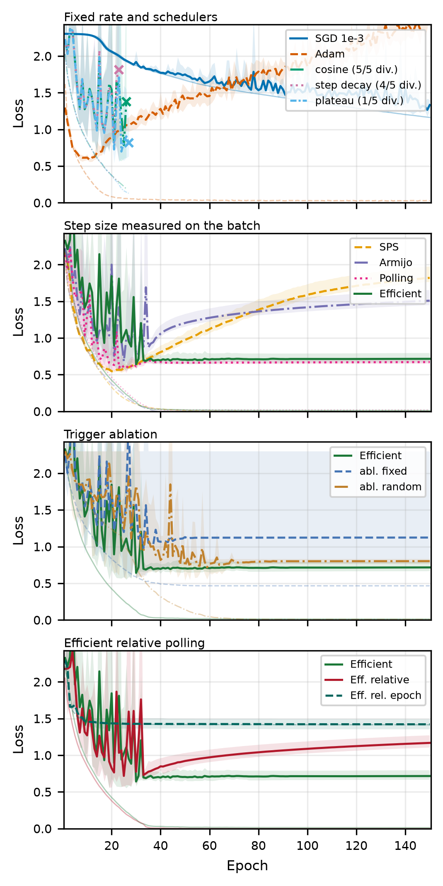 |  |
| Perda de treino e validação, treze configurações. | LR média selecionada por época, symlog, com um X marcando divergência. |

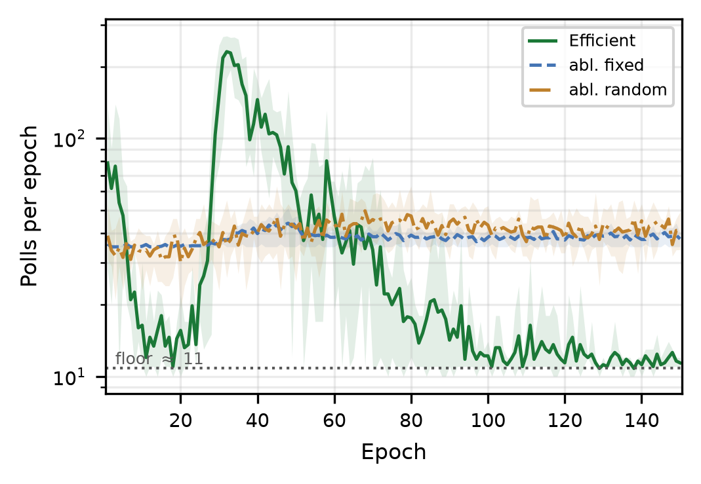

Os polls se concentram exatamente onde o cronograma muda: o piso de regime permanente é `704 / (K_max + 1) ≈ 11` polls/época, a mediana sobre todas as épocas é 16,4, e a contagem tem seu pico em 231 na época 32, o momento exato em que a LR selecionada começa a colapsar de `1e-1` para `1e-5`, quando polls discordantes resetam o intervalo para um repetidamente. É esse o mecanismo que permite a ~5% dos polls recuperarem o cronograma completo de duas fases, ao custo que o [modelo de custo](methods.md#modelo-de-custo) prevê.

### Ablação do gatilho

Duas variantes de controle isolam a contribuição do backoff adaptativo trocando apenas o gatilho, mantendo o conjunto de candidatos, a regra de seleção e a guarda de dois níveis inalterados: `fixed` faz poll em intervalo constante (`K = 19`) e `random` faz poll em cada batch independentemente com probabilidade `p = 0,05`, ambos calibrados para a taxa de ~5% que o backoff mede.

Na acurácia final, o **gatilho aleatório é competitivo**: 84,02% de teste contra 83,76% do backoff, dentro da variação entre seeds. É um resultado negativo honesto para a leitura forte da alegação: nesse orçamento, distribuir os polls uniformemente ao acaso já basta para acompanhar o cronograma, desde que a guarda absorva o custo de chegar atrasado na transição. A alegação sustentada é a mais fraca. O backoff alcança a mesma qualidade gastando seus polls onde eles carregam informação (16,4 polls numa época mediana contra um pico de 231 na transição, uma razão de 14×, contra um patamar plano de ~40/época para os dois controles), precisando de **~2,4× menos** intervenções de guarda disparadas por spike (378 contra 919 e 888) e ligeiramente menos passos de otimizador.

O **controle de intervalo fixo expõe uma falha real**: em 4/5 seeds ele iguala as outras variantes (84,17% ± 0,96% de validação), mas na seed restante nunca sai do patamar de inicialização, terminando em ~10% de acurácia (nível de chute aleatório). Na inicialização todo candidato empata, o poll continua retornando a menor LR candidata pela regra de desempate, e em `1e-5` os pesos se movem pouco demais para algum dia quebrar o empate. No CIFAR-10 o backoff adaptativo escapa disso, porque faz poll a cada batch até os candidatos diferirem pela primeira vez. Essa proteção se mostrou mais fraca do que parece aqui: com cem classes uma única resposta certa basta para distinguir os candidatos, e no CIFAR-100 o backoff travou [do mesmo jeito](#o-que-os-quatro-datasets-acrescentam).

### Efficient Relative Polling

Mesmo protocolo, cinco seeds, candidatos limitados a `1e-1`:

| Método | Melhor Val | Acurácia Teste | Perda Teste | Polls | Passos do otimizador | s/Época |
|---|---|---|---|---|---|---|
| Efficient Polling (grade fixa) | 84,37% ± 0,91% | 83,76% ± 0,72% | 0,7392 ± 0,0201 | 5,43% | 134.261 | 2,81 ± 0,02 |
| **Efficient Relative Polling, por batch** | 84,68% ± 0,77% | **84,11% ± 0,41%** | 0,9803 ± 0,1398 | 7,25% ± 6,25% | 127.379 | 2,82 ± 0,25 |
| Efficient Relative Polling, por época | 48,18% ± 2,61% | 47,99% ± 1,91% | 1,4184 ± 0,0450 | 61,33% | 234.432 | 6,47 ± 0,52 |

Por batch, o Efficient Relative Polling alcança a acurácia de teste do Armijo backtracking (84,09%, o melhor método de comparação) ao custo do SGD puro, com poll em 7% dos batches; um poll custa 4 passos do otimizador em vez de 6, então ele dá menos passos que o Efficient Polling. Ele encontra a mesma primeira fase em `1e-1` e depois se assenta em `1e-2` da época ~40 até o fim, em vez de anelar até `1e-5`: quando a acurácia do batch satura o critério fica cego, empates mantêm a taxa, e nenhum estouro forçou um degrau para baixo (um restart em cinco runs). Esse patamar é o que custa perda de teste. O treino continua em `1e-2` sobre um conjunto de treino que ele já ajusta, e as predições ficam superconfiantes. A fração de polls varia por seed (1,8% a 16,3%): uma seed que fica caçando entre `1e-1` e `1e-2` zera o intervalo a cada mudança.

**A taxa que o usuário escolhe não precisa estar certa.** Partindo de duas décadas abaixo ou acima do padrão, na seed 42:

| Início | Efficient Polling (grade presa ao início) | Efficient Relative Polling |
|---|---|---|
| `1e-5` | 10,04%, nunca sai de `1e-7` | 84,72% |
| `1e-3` (padrão) | 83,97% | 84,67% |
| `1e-1` | 9,98%, explode em `10` | 84,62% |

De qualquer início a janela relativa está em `1e-1` na primeira época e reproduz o mesmo cronograma.

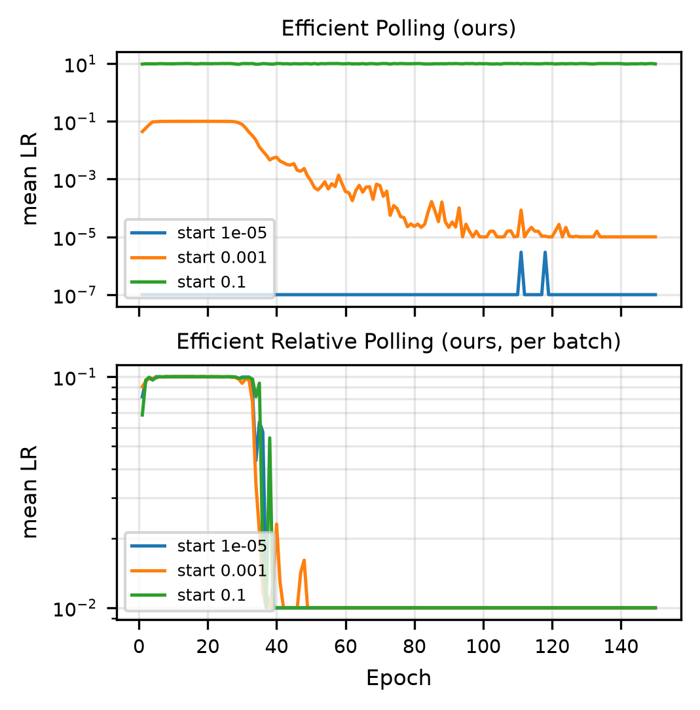

**Por época é um resultado negativo.** O `EfficientRelativeEpochPolling`, conduzido por `fit(..., epoch_polling=...)`, treina uma época inteira por candidato a partir de um snapshot e mantém a que teve a menor perda média de treino. Ele leva a taxa até `1e-5` em trinta épocas e estaciona em 48%; selecionar pela acurácia de validação no fim da época fez o mesmo, até `1e-8` e 45%. Qualquer nota de uma única época premia a suavidade de um passo pequeno em vez do progresso de um passo grande, e uma época cega em `1e-1` não tem a proteção por passo que o método por batch ganha com os polls de spike. A granularidade que funciona é o batch.

## CIFAR-100, Fashion-MNIST, MNIST e Covertype

O protocolo é o do CIFAR-10, com três diferenças:

- **Calibração das ablações.** As duas ablações do gatilho fazem poll na taxa que o Efficient Polling mediu na seed 42 do mesmo dataset, enquanto as do CIFAR-10 usaram os 5% do artigo:

  | Dataset | Taxa de poll | Intervalo fixo `K` |
  |---|---|---|
  | CIFAR-100 | 10,11% | 9 |
  | Fashion-MNIST | 9,26% | 10 |
  | MNIST | 23,56% | 3 |
  | Covertype | 8,26% | 11 |

- **Sem coluna de tempo.** Essas runs dividiram uma GPU, três por vez, então seus segundos por época não são comparáveis nem entre si nem com os do CIFAR-10. Aqui a medida de custo são os passos do otimizador.
- **O split do Covertype.** A validação sai das primeiras 15.120 linhas, que têm 2.160 linhas de cada classe; o teste são as 565.892 restantes, onde uma classe ocupa cerca de metade das linhas. Todo método perde de 12 a 14 pontos da validação para o teste.

### O que os quatro datasets acrescentam

**O Efficient Polling trava no menor candidato no CIFAR-100.** Todas as seeds começaram com acurácia de treino abaixo de 2%, o dobro do acaso, com a taxa escolhida no piso de `1e-5` na maior parte desse tempo:

| Seed | Épocas abaixo de 2% de acurácia de treino | Poll | Acurácia de teste |
|---|---|---|---|
| 42 | 35 | 10,11% | 52,90% |
| 43 | 128 | 2,13% | 41,79% |
| 44 | 136 | 2,17% | 27,68% |
| 45 | 150 | 1,98% | 1,25% |
| 46 | 150 | 2,02% | 1,73% |

A causa é a regra de sinal do backoff diante de cem classes. A regra só deixa o intervalo de poll crescer depois que algum poll viu as acurácias de batch dos candidatos diferirem, e registra isso uma vez só. No nível do acaso, um batch de 64 não tem nenhuma resposta certa 53% das vezes e tem no máximo uma 87% das vezes, então os candidatos empatam em quase todo poll, e o empate vai para o menor candidato. Mais cedo ou mais tarde um candidato acerta uma resposta a mais que outro e a regra registra sinal. Daí em diante cada empate devolve `1e-5` de novo, que o backoff lê como escolha estável, dobrando o intervalo até o teto. O Polling base faz poll em todo batch, e o Efficient Relative Polling mantém a taxa num empate e alarga a janela quando fica cego; nenhum dos dois travou.

**As ablações do gatilho travam mais vezes, e em mais datasets.** Runs, de cinco, que começaram com acurácia de treino abaixo do dobro do acaso por pelo menos 20 épocas; entre parênteses, as que nunca saíram dali:

| Método | CIFAR-10 | CIFAR-100 | Fashion-MNIST | MNIST | Covertype |
|---|---|---|---|---|---|
| Polling (paper base) | 0 | 0 | 0 | 0 | 0 |
| Efficient Polling (nosso) | 0 | 5 (2) | 0 | 1 | 0 |
| ↳ ablação: intervalo fixo | 1 (1) | 2 (2) | 2 (1) | 3 (1) | 0 |
| ↳ ablação: gatilho aleatório | 2 | 1 (1) | 2 | 2 (2) | 0 |
| Efficient Relative Polling (nosso, por batch) | 0 | 0 | 0 | 0 | 0 |

É daí que vêm os desvios grandes delas na tabela acima. No Fashion-MNIST e no MNIST os controles travam onde o backoff não trava, com a mesma taxa de poll: o backoff faz poll a cada batch até os candidatos diferirem pela primeira vez e zera o intervalo sempre que a escolha muda, enquanto os controles mantêm seu cronograma não importa o que o poll encontre. O Covertype, com sete classes, não travou nada.

**Os schedulers divergem em quatro dos cinco datasets.** Runs, de cinco, cuja perda de validação virou `NaN`:

| Método | CIFAR-10 | CIFAR-100 | Fashion-MNIST | MNIST | Covertype |
|---|---|---|---|---|---|
| SGD + cosine annealing | 5 | 3 | 0 | 2 | 0 |
| SGD + step decay | 4 | 4 | 1 | 3 | 0 |
| SGD + ReduceLROnPlateau | 1 | 0 | 0 | 0 | 0 |

Uma seed do cosine no MNIST divergiu na época 3 e fica só com seu checkpoint de 93,10%, que é de onde vem o desvio de 2,79 pontos dessa linha.

**O Efficient Polling custa mais no MNIST.** Ele faz poll em 24,70% dos batches do MNIST e dá 2,23× os passos de otimizador do SGD. No fim do treino sua escolha continua mudando, e cada mudança zera o intervalo; ele também faz rollback 12 vezes por run, contra menos de uma no CIFAR-10. O Efficient Relative Polling faz poll em 4,17% dos mesmos batches.

### CIFAR-100

| Método | Melhor Val | Acc Teste | Perda Teste | Poll | Passos do Otimizador |
|---|---|---|---|---|---|
| SGD (fixo `1e-3`) | 20,28% ± 0,79% | 20,21% ± 1,15% | 3,3492 ± 0,0524 | n/a | 105.600 |
| Adam (`1e-3`) | 49,55% ± 1,30% | 48,98% ± 0,63% | 2,1944 ± 0,1808 | n/a | 105.600 |
| SGD + cosine annealing | 51,42% ± 1,86% | 51,50% ± 1,83% | 4,0845 ± 1,3127 | n/a | 105.600 |
| SGD + step decay | 49,14% ± 2,69% | 49,77% ± 2,71% | 3,2161 ± 1,1185 | n/a | 105.600 |
| SGD + ReduceLROnPlateau | 52,61% ± 0,40% | 53,03% ± 0,51% | 2,9802 ± 1,1601 | n/a | 105.600 |
| SPS (Polyak) | 52,87% ± 0,52% | 52,98% ± 0,56% | 2,3980 ± 0,1645 | n/a | 105.600 |
| Armijo line search | 52,11% ± 0,85% | 52,57% ± 0,62% | 5,5351 ± 0,1655 | 100% | 105.806 |
| Polling (paper base) | 52,97% ± 0,86% | 52,99% ± 0,55% | 3,5409 ± 0,0485 | 100% | 633.600 |
| Efficient Polling (nosso) | 25,03% ± 23,06% | 25,07% ± 23,31% | 3,7104 ± 0,8980 | 3,68% ± 3,59% | 125.042 |
| ↳ ablação: intervalo fixo | 32,87% ± 29,13% | 32,11% ± 28,41% | 4,5221 ± 0,1168 | 10,58% ± 0,53% | 161.452 |
| ↳ ablação: gatilho aleatório | 42,74% ± 23,39% | 42,53% ± 23,22% | 4,4912 ± 0,0994 | 11,57% ± 0,77% | 166.695 |
| Efficient Relative Polling (nosso, por batch) | 53,28% ± 0,90% | 53,05% ± 0,57% | 5,1240 ± 0,4442 | 3,32% ± 0,72% | 113.688 |
| ↳ por época | 20,67% ± 0,74% | 21,11% ± 0,61% | 3,2956 ± 0,0268 | 64,67% ± 8,78% | 240.768 |

| | | |
|---|---|---|
| 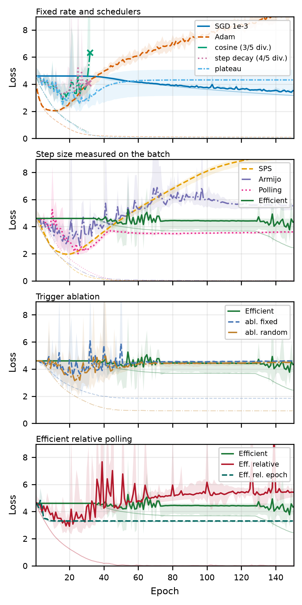 | 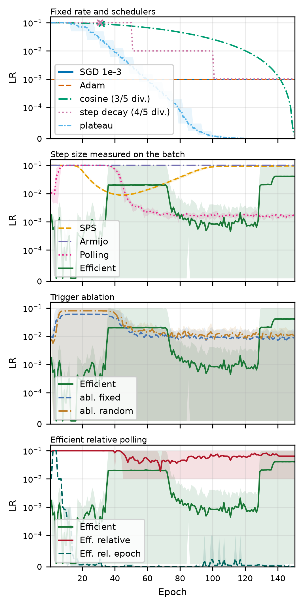 | 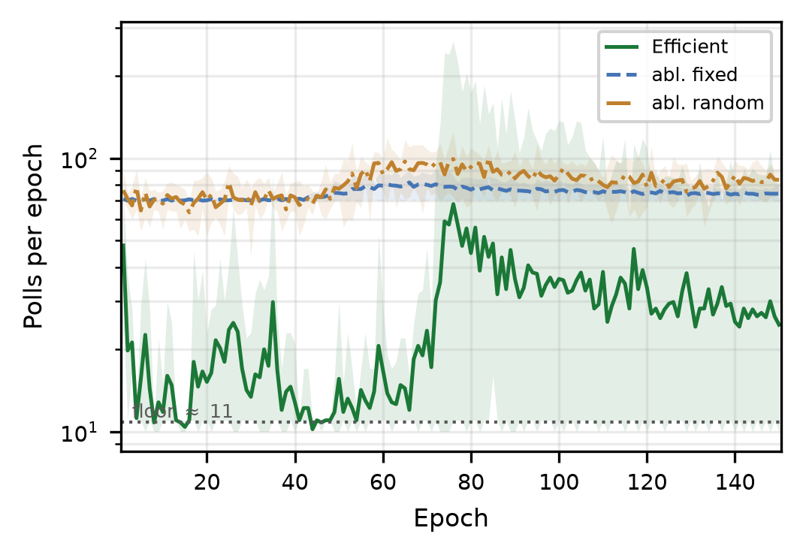 |

### Fashion-MNIST

| Método | Melhor Val | Acc Teste | Perda Teste | Poll | Passos do Otimizador |
|---|---|---|---|---|---|
| SGD (fixo `1e-3`) | 86,17% ± 0,37% | 85,43% ± 0,33% | 0,4090 ± 0,0086 | n/a | 126.600 |
| Adam (`1e-3`) | 93,61% ± 0,36% | 92,70% ± 0,31% | 0,7485 ± 0,1454 | n/a | 126.600 |
| SGD + cosine annealing | 92,65% ± 0,42% | 92,41% ± 0,07% | 0,5876 ± 0,0809 | n/a | 126.600 |
| SGD + step decay | 92,65% ± 0,30% | 92,16% ± 0,32% | 0,4567 ± 0,1217 | n/a | 126.600 |
| SGD + ReduceLROnPlateau | 92,76% ± 0,33% | 92,02% ± 0,11% | 0,3754 ± 0,0962 | n/a | 126.600 |
| SPS (Polyak) | 92,63% ± 0,44% | 91,88% ± 0,19% | 0,3518 ± 0,0705 | n/a | 126.600 |
| Armijo line search | 92,74% ± 0,34% | 91,91% ± 0,37% | 0,4926 ± 0,2230 | 100% | 129.729 |
| Polling (paper base) | 92,56% ± 0,39% | 91,83% ± 0,36% | 0,2659 ± 0,0316 | 100% | 759.600 |
| Efficient Polling (nosso) | 92,57% ± 0,35% | 91,84% ± 0,25% | 0,3177 ± 0,0595 | 8,46% ± 1,33% | 180.129 |
| ↳ ablação: intervalo fixo | 75,97% ± 36,74% | 75,35% ± 36,51% | 0,6879 ± 0,9050 | 9,38% ± 0,59% | 185.943 |
| ↳ ablação: gatilho aleatório | 92,16% ± 0,43% | 91,52% ± 0,46% | 0,3047 ± 0,0707 | 9,79% ± 0,86% | 188.574 |
| Efficient Relative Polling (nosso, por batch) | 92,27% ± 0,22% | 91,70% ± 0,24% | 0,2574 ± 0,0061 | 1,87% ± 0,21% | 133.656 |
| ↳ por época | 81,71% ± 3,41% | 80,98% ± 3,43% | 0,5207 ± 0,0917 | 57,73% ± 12,85% | 272.106 |

| | | |
|---|---|---|
| 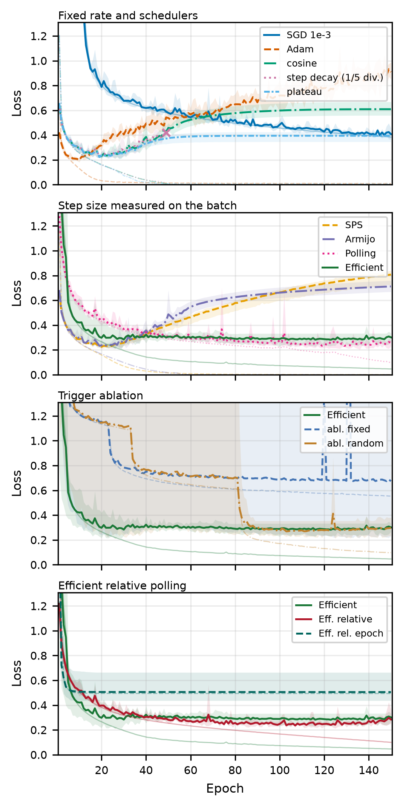 | 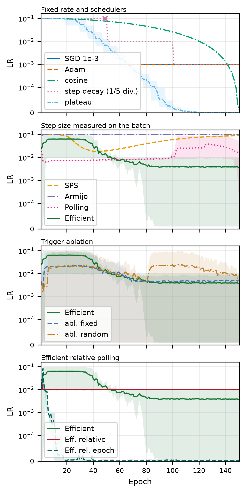 | 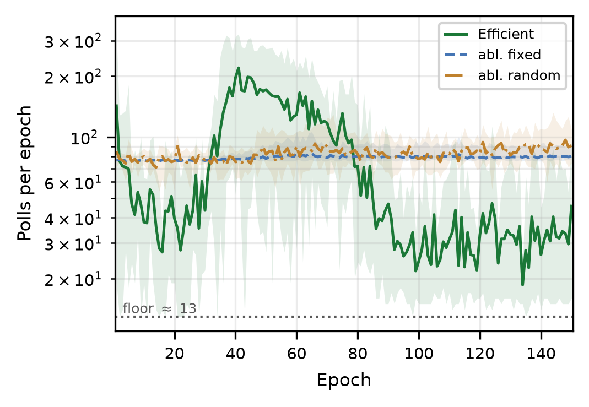 |

### MNIST

| Método | Melhor Val | Acc Teste | Perda Teste | Poll | Passos do Otimizador |
|---|---|---|---|---|---|
| SGD (fixo `1e-3`) | 98,35% ± 0,20% | 98,46% ± 0,06% | 0,0460 ± 0,0029 | n/a | 126.600 |
| Adam (`1e-3`) | 99,52% ± 0,07% | 99,45% ± 0,10% | 0,0385 ± 0,0075 | n/a | 126.600 |
| SGD + cosine annealing | 97,90% ± 3,29% | 98,09% ± 2,79% | 0,0653 ± 0,0900 | n/a | 126.600 |
| SGD + step decay | 99,31% ± 0,15% | 99,30% ± 0,07% | 0,0249 ± 0,0035 | n/a | 126.600 |
| SGD + ReduceLROnPlateau | 99,30% ± 0,11% | 99,31% ± 0,06% | 0,0231 ± 0,0036 | n/a | 126.600 |
| SPS (Polyak) | 99,11% ± 0,12% | 99,11% ± 0,05% | 0,0353 ± 0,0047 | n/a | 126.600 |
| Armijo line search | 99,36% ± 0,16% | 99,39% ± 0,03% | 0,0263 ± 0,0028 | 100% | 333.784 |
| Polling (paper base) | 97,98% ± 0,18% | 98,14% ± 0,07% | 0,0578 ± 0,0051 | 100% | 759.600 |
| Efficient Polling (nosso) | 98,74% ± 0,48% | 98,82% ± 0,48% | 0,0349 ± 0,0149 | 24,70% ± 2,76% | 282.911 |
| ↳ ablação: intervalo fixo | 81,18% ± 39,11% | 81,37% ± 39,14% | 0,4911 ± 1,0249 | 26,32% ± 1,18% | 293.174 |
| ↳ ablação: gatilho aleatório | 63,66% ± 48,35% | 63,64% ± 48,54% | 0,9414 ± 1,2544 | 26,18% ± 2,43% | 292.349 |
| Efficient Relative Polling (nosso, por batch) | 98,45% ± 0,16% | 98,59% ± 0,09% | 0,0420 ± 0,0022 | 4,17% ± 2,24% | 142.379 |
| ↳ por época | 97,84% ± 0,81% | 98,12% ± 0,72% | 0,0576 ± 0,0220 | 60,27% ± 13,94% | 277.676 |

| | | |
|---|---|---|
| 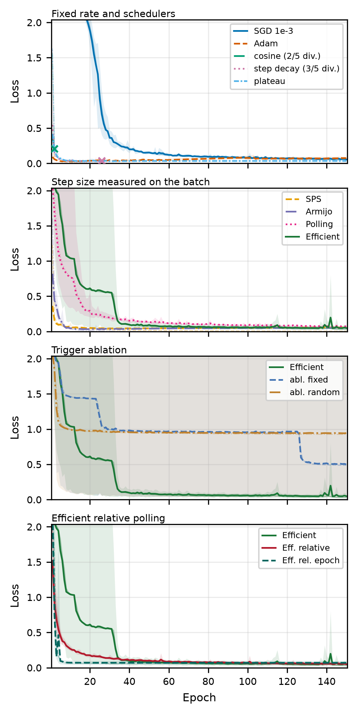 | 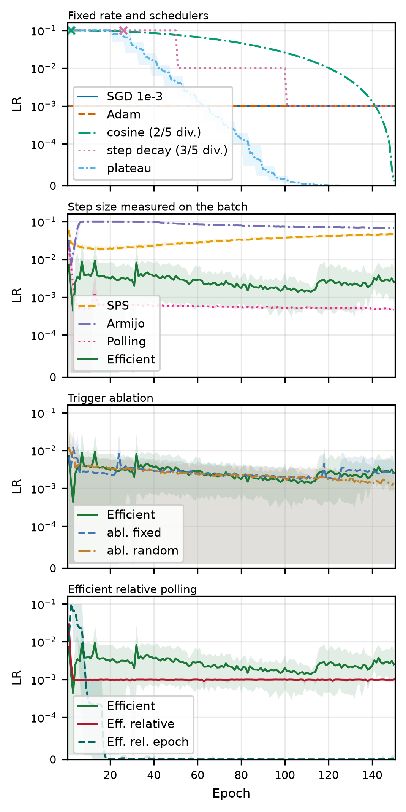 | 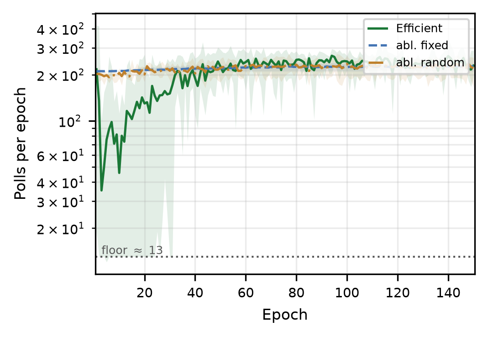 |

### Covertype

| Método | Melhor Val | Acc Teste | Perda Teste | Poll | Passos do Otimizador |
|---|---|---|---|---|---|
| SGD (fixo `1e-3`) | 70,46% ± 0,92% | 56,38% ± 0,45% | 0,9896 ± 0,0083 | n/a | 31.950 |
| Adam (`1e-3`) | 87,84% ± 0,68% | 75,03% ± 0,49% | 1,6219 ± 0,2428 | n/a | 31.950 |
| SGD + cosine annealing | 88,21% ± 0,66% | 75,64% ± 0,73% | 0,9932 ± 0,0298 | n/a | 31.950 |
| SGD + step decay | 87,66% ± 0,61% | 75,58% ± 0,29% | 0,7140 ± 0,0341 | n/a | 31.950 |
| SGD + ReduceLROnPlateau | 87,17% ± 0,83% | 74,89% ± 0,87% | 0,6892 ± 0,0127 | n/a | 31.950 |
| SPS (Polyak) | 88,08% ± 0,58% | 75,62% ± 0,59% | 1,0082 ± 0,1284 | n/a | 31.950 |
| Armijo line search | 87,93% ± 0,69% | 74,68% ± 0,28% | 1,2712 ± 0,1001 | 100% | 32.079 |
| Polling (paper base) | 88,01% ± 0,48% | 75,15% ± 0,71% | 1,0818 ± 0,0406 | 100% | 191.700 |
| Efficient Polling (nosso) | 88,00% ± 0,67% | 75,79% ± 0,95% | 1,1289 ± 0,1101 | 8,63% ± 0,69% | 45.733 |
| ↳ ablação: intervalo fixo | 88,08% ± 0,83% | 75,24% ± 0,58% | 1,0737 ± 0,1598 | 8,50% ± 0,04% | 45.535 |
| ↳ ablação: gatilho aleatório | 87,70% ± 0,65% | 74,99% ± 0,60% | 1,0909 ± 0,0787 | 8,45% ± 0,14% | 45.445 |
| Efficient Relative Polling (nosso, por batch) | 87,92% ± 0,75% | 75,41% ± 0,60% | 1,1716 ± 0,1410 | 1,94% ± 0,26% | 33.266 |
| ↳ por época | 74,12% ± 1,03% | 60,47% ± 0,56% | 0,8831 ± 0,0049 | 62,40% ± 9,58% | 71.398 |

| | | |
|---|---|---|
| 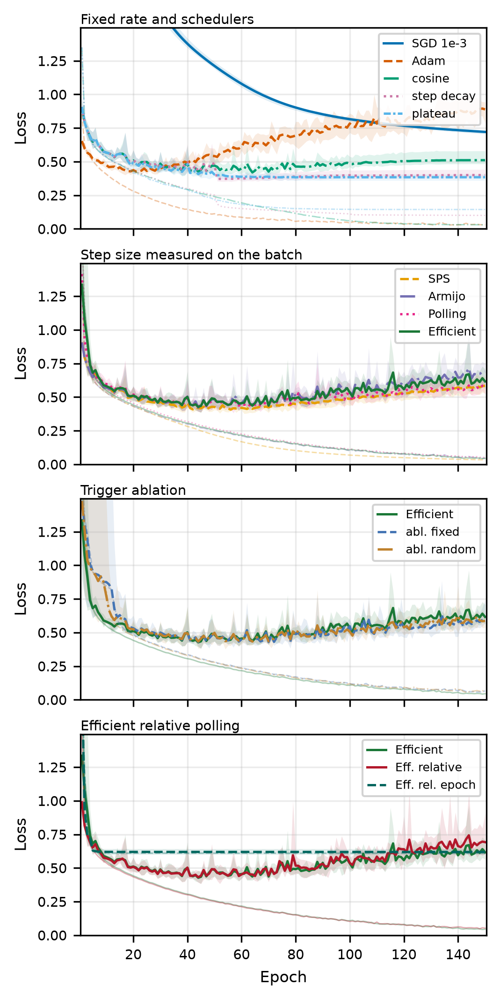 | 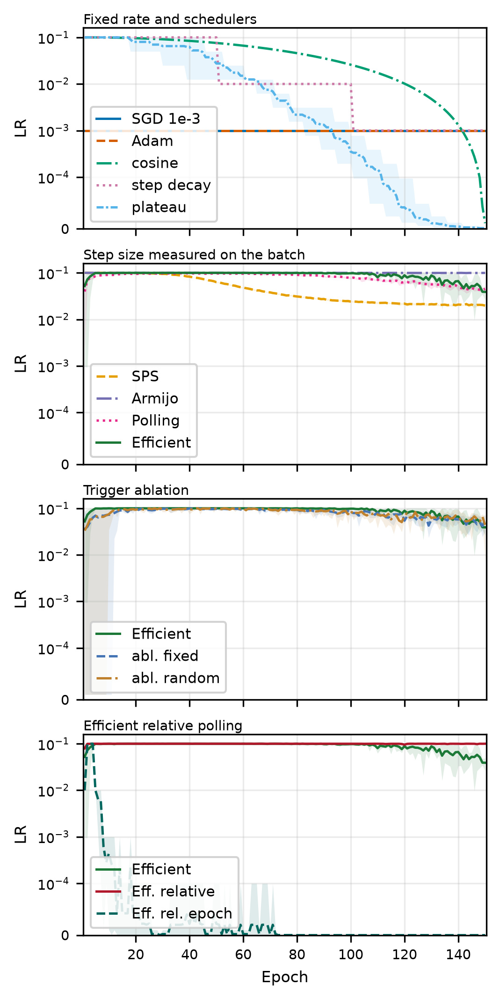 | 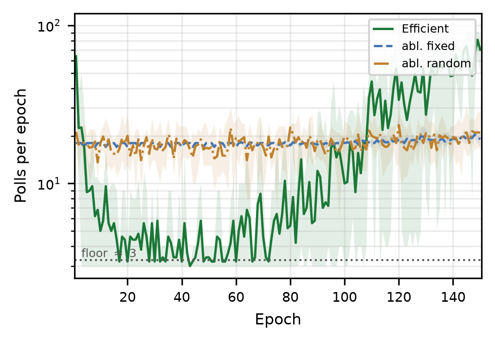 |
